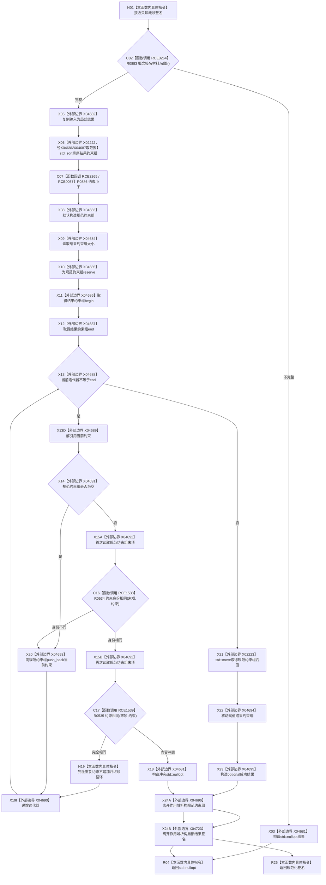

# CF-L6-0353 概念图算法规范化概念签名现状流程图

图类型：现状流程图
代码版本：`0a93526882cb33c61c2fbb04ecad1aeaddcfe225`
工作区复核基线：`2089268fbb3833ebc77486169b98d8a14c49d508`
源码 blob：`31c9794099a8fc191c3d5d9369010c52cd863039`
覆盖文件：`海中鱼巣/领域/概念图算法.h:224-243`
唯一根函数：R0532
完整签名：`static std::optional<概念签名材料> 海中鱼巣::概念图算法::规范化概念签名(const 概念签名材料& 输入)`
参数：输入为 `const 概念签名材料&`，只读借用
返回结果：输入不完整或同一约束身份出现不相同材料时返回 `std::nullopt`；否则返回按约束顺序排序并去掉完全重复项的签名副本
已登记调用方：F0362（RCE0131）、R0533（RCE1540）
直接项目函数：R0534（RCE1538）、R0535（RCE1539）、R0883（RCE3264）、R0886（RCE3265；RCB0057）
外部边界：X02222、X02223、X04681—X04696、X04723
逐行映射表：`流程图/代码流程图/L6/CF-L6-0353_概念图算法规范化概念签名_逐行代码映射表.md`
结构读写：只写局部签名副本和局部规范约束组，不写权威结构
不得作为施工许可：是
不得宣称：规范化成功代表签名已发布、已登记或符合全部正式业务语义

## 流程图

## 当前边界

- C02 调用已登记项目函数 R0883；R0883 再经 RCE3270 / RCB0059 调 R0884，并由 R0884 经 RCE3271 调 R0885 检查逐个约束。
- 排序比较器 `约束小于` 已登记为 R0886；R0886 经 RCE3273 调 R0887 比较定义节点句柄。
- 本函数只改变局部副本；任一 `nullopt` 分支均不写权威结构。
