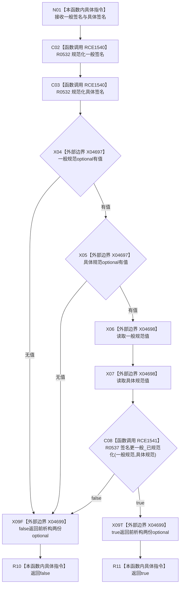

# CF-L6-0354 概念图算法概念签名更一般现状流程图

图类型：现状流程图
代码版本：`0a93526882cb33c61c2fbb04ecad1aeaddcfe225`
工作区复核基线：`2089268fbb3833ebc77486169b98d8a14c49d508`
源码 blob：`31c9794099a8fc191c3d5d9369010c52cd863039`
覆盖文件：`海中鱼巣/领域/概念图算法.h:253-262`
唯一根函数：R0533
完整签名：`static bool 海中鱼巣::概念图算法::概念签名更一般(const 概念签名材料& 一般, const 概念签名材料& 具体)`
参数：一般、具体均为 `const 概念签名材料&`，只读借用
返回结果：两份签名均可规范化且 R0537 判定一般签名严格更一般时返回 `true`，否则返回 `false`
已登记调用方：F0362（RCE0133）
直接项目函数：R0532（RCE1540，两处调用）、R0537（RCE1541）
外部边界：X04697（optional 有值）、X04698（optional 取值）、X04699（optional 析构）
逐行映射表：`流程图/代码流程图/L6/CF-L6-0354_概念图算法概念签名更一般_逐行代码映射表.md`
结构读写：只读输入并持有两份局部 optional 结果
不得作为施工许可：是
不得宣称：返回 `true` 代表概念节点、关系或活动图已创建或发布

## 流程图

## 当前边界

- 两次规范化调用无短路，始终依次执行；只有后续 `if` 条件按 `||` 短路。
- `value()` 仅在两份 optional 都有值后执行；所有返回路径离开作用域时释放两份局部 optional。
