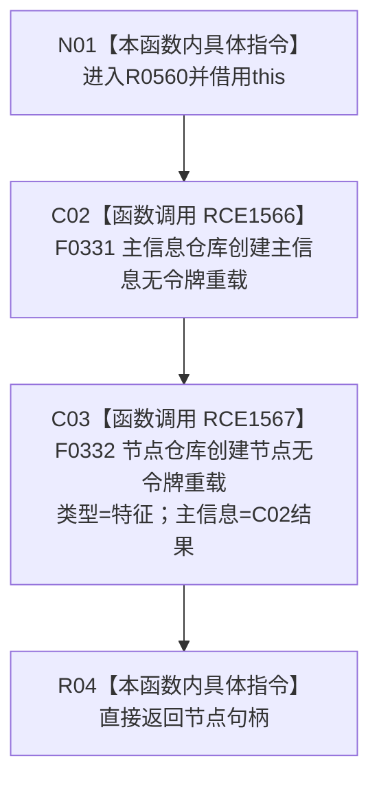

# CF-L6-0355 特征服务创建特征类型现状流程图

图类型：现状流程图
代码版本：`0a93526882cb33c61c2fbb04ecad1aeaddcfe225`
工作区复核基线：`03a8b7ac099ccea83e57f2696e2290b7bcdfacaf`
源码 blob：`4c7bcd451f2e46e85d707a40c371dcbeaa2c1169`
覆盖文件：`海中鱼巣/领域/特征服务.h:216-218`
唯一根函数：R0560
完整签名：`节点句柄 海中鱼巣::特征服务::创建特征类型()`
参数：无显式参数；隐式 `this` 为非拥有借用
返回结果：先创建主信息，再以该主信息创建并返回一个 `节点类型::特征` 节点句柄
已登记调用方：R0249（RCE0838）、R0762（RCE2596）、R0847（RCE3124）
直接项目函数：F0331（RCE1566）`主信息仓库::创建主信息()`、F0332（RCE1567）`节点仓库::创建节点(节点类型, 主信息句柄)`
外部边界：无
逐行映射表：`流程图/代码流程图/L6/CF-L6-0355_特征服务创建特征类型_逐行代码映射表.md`
结构读写：本函数委托两个仓库函数创建主信息与特征节点
不得作为施工许可：是
不得宣称：返回非零句柄证明两次仓库写入已形成跨仓原子事务

## 流程图

## 当前边界

- C02 必先完成并形成 C03 的主信息实参，随后才进入 C03。
- 本函数不检查主信息句柄或节点句柄；失败表示由被调仓库函数的返回值直接传递。
