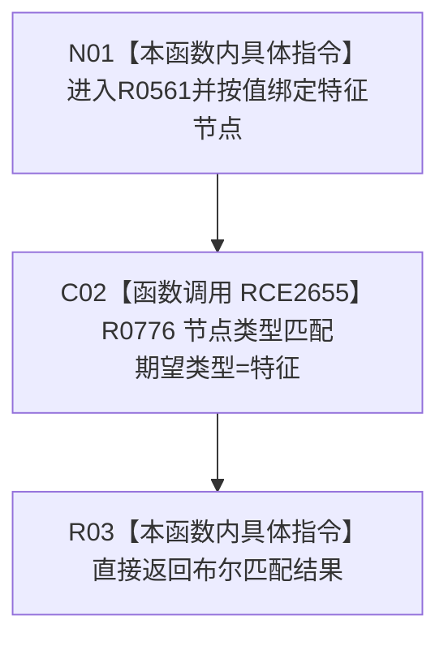

# CF-L6-0356 特征服务节点是特征现状流程图

图类型：现状流程图
代码版本：`0a93526882cb33c61c2fbb04ecad1aeaddcfe225`
工作区复核基线：`03a8b7ac099ccea83e57f2696e2290b7bcdfacaf`
源码 blob：`4c7bcd451f2e46e85d707a40c371dcbeaa2c1169`
覆盖文件：`海中鱼巣/领域/特征服务.h:227-229`
唯一根函数：R0561
完整签名：`bool 海中鱼巣::特征服务::节点是特征(节点句柄 特征节点) const`
参数：`特征节点` 按值输入；隐式 `this` 为 const 非拥有借用
返回结果：直接返回 R0776 对目标句柄与 `节点类型::特征` 的匹配结果
已登记调用方：F0554（RCE0256）、R0762（RCE2594）、R0778（RCE2663）、R0779（RCE2667）、R0847（RCE3125）、R0859（RCE3164）
直接项目函数：R0776（RCE2655）
外部边界：无
逐行映射表：`流程图/代码流程图/L6/CF-L6-0356_特征服务节点是特征_逐行代码映射表.md`
结构读写：只读节点仓库投影，不修改结构
不得作为施工许可：是
不得宣称：返回 `true` 证明该节点已经绑定特征定义、槽位或特征值关系

## 流程图

## 当前边界

- 本函数只检查节点记录当前类型，不验证任何特征关系或业务材料。
- 无本地错误转换；R0776 的 `false` 直接成为本函数结果。
