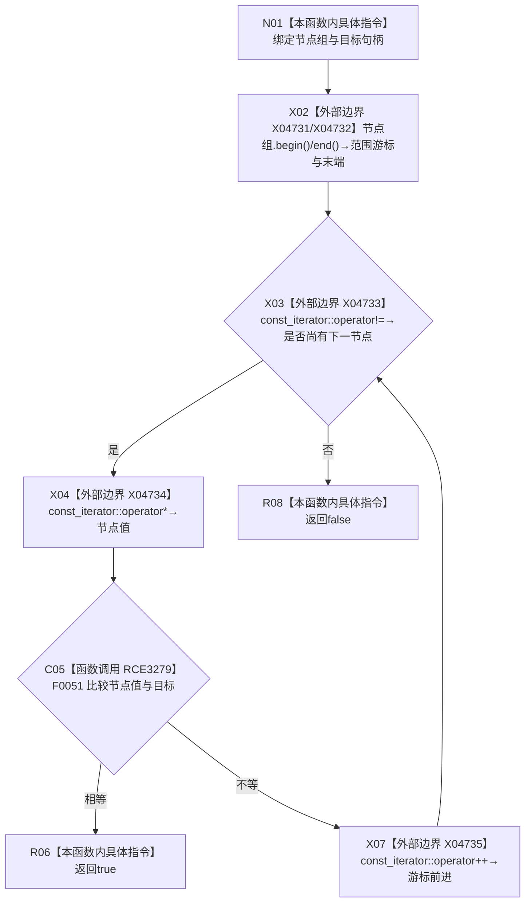

# CF-L6-0357 节点组包含现状流程图

图类型：现状流程图
代码版本：`0a93526882cb33c61c2fbb04ecad1aeaddcfe225`
工作区复核基线：`03a8b7ac099ccea83e57f2696e2290b7bcdfacaf`
源码 blob：`1355a1afd544cd44c14ee904246e9cb0778fb39b`
覆盖文件：`海中鱼巣/领域/语素服务.h:269-276`
唯一根函数：R0570
完整签名：`bool 海中鱼巣::语素服务::节点组包含(const std::vector<节点句柄>& 节点组, 节点句柄 目标) const`
参数：`节点组` 以 const 引用借用；`目标` 按值输入
返回结果：遍历时首次发现与目标相等的节点句柄即返回 `true`；遍历完成无匹配返回 `false`
已登记调用方：F0364（RCE0141）、R0573（RCE1585）
直接项目函数：F0051（RCE3279）
外部边界：X04731 `std::vector<节点句柄>::begin() const`、X04732 `end() const`、X04733 const_iterator `operator!=`、X04734 `operator*`、X04735 `operator++`
逐行映射表：`流程图/代码流程图/L6/CF-L6-0357_节点组包含_逐行代码映射表.md`
结构读写：只读传入向量及节点句柄
不得作为施工许可：是
不得宣称：找到匹配代表句柄当前有效或节点类型符合任何业务合同

## 流程图

## 当前边界

- 范围 `for` 的五个标准库调用按容器与 const 迭代器静态类型分别登记。
- 函数按首个相等项提前返回，不检查重复项。
