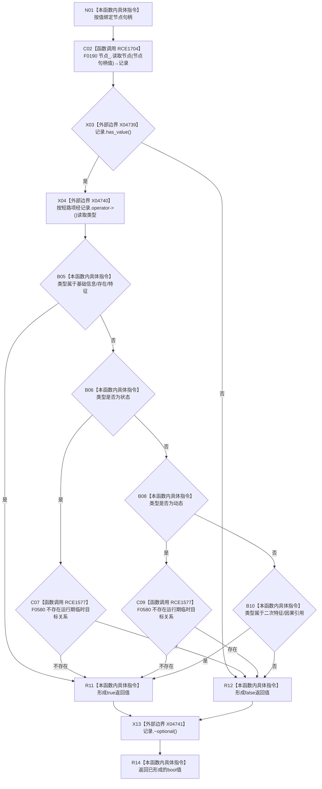

# CF-L6-0359 节点是可作为概念追溯目标现状流程图

图类型：现状流程图
代码版本：`0a93526882cb33c61c2fbb04ecad1aeaddcfe225`
工作区复核基线：`03a8b7ac099ccea83e57f2696e2290b7bcdfacaf`
源码 blob：`1355a1afd544cd44c14ee904246e9cb0778fb39b`
覆盖文件：`海中鱼巣/领域/语素服务.h:296-308`
唯一根函数：R0572
完整签名：`bool 海中鱼巣::语素服务::节点是可作为概念追溯目标(节点句柄 节点句柄值) const`
参数：`节点句柄值` 按值输入
返回结果：节点存在，且类型属于基础信息、存在、特征、二次特征或因果引用；状态或动态还必须不存在以该节点为目标的运行期临时关系时返回 `true`，否则返回 `false`
已登记调用方：F0364（RCE0137）
直接项目函数：F0190（RCE1704）、F0580（RCE1577）
外部边界：X04739 `std::optional<节点记录>::has_value`、X04740 `operator->`、X04741 `~optional`
逐行映射表：`流程图/代码流程图/L6/CF-L6-0359_节点是可作为概念追溯目标_逐行代码映射表.md`
结构读写：只读节点记录与运行期临时目标关系存在性
不得作为施工许可：是
不得宣称：节点可作为追溯目标代表语素概念追溯关系已经创建

## 流程图

## 当前边界

- 类型判断为一个左到右短路 `||` 表达式；状态和动态分支才调用 F0580。
- 场景、需求、任务和方法不在本函数允许的概念追溯目标集合中；X04741 在任一返回路径离开作用域前析构局部 optional 记录。
