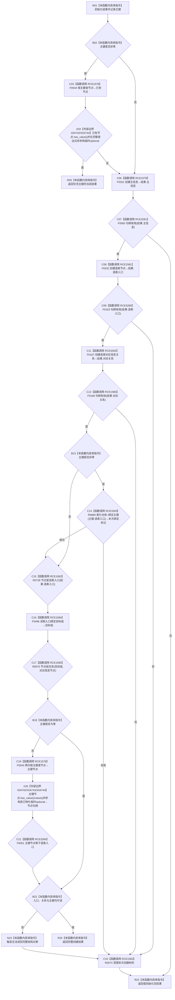

# CF-L6-0360 创建语素入口并保留收口材料现状流程图

图类型：现状流程图
代码版本：`0a93526882cb33c61c2fbb04ecad1aeaddcfe225`
工作区复核基线：`03a8b7ac099ccea83e57f2696e2290b7bcdfacaf`
源码 blob：`1355a1afd544cd44c14ee904246e9cb0778fb39b`
覆盖文件：`海中鱼巣/领域/语素服务.h:328-370`
唯一根函数：R0573
完整签名：`语素入口创建结果 海中鱼巣::语素服务::创建语素入口并保留收口材料(节点句柄 对应信息节点, std::uint64_t 主键)`
参数：`对应信息节点`、`主键` 均按值输入；主键为零时跳过索引占用检查与绑定
返回结果：成功时返回含语素入口、主信息、对应关系、主键及本次绑定标记的结果；各失败分支返回当前结果或值初始化空结果，并按已创建材料执行清理
已登记调用方：F0364（RCE0138）
直接项目函数：F0544（RCE1578）、F0331（RCE1579）、F0565（RCE3281）、F0332（RCE1581）、F0163（RCE3280）、F0167（RCE3282）、F0168（RCE1580）、R0574（RCE1582）、R0889（RCE3283）、R0728（RCE1583）、F0496（RCE1584）、R0570（RCE1585）、F0051（RCE3284）
外部边界：X04742 `std::optional<节点句柄>::has_value`、X04743 `value`、X04744 `~optional`
逐行映射表：`流程图/代码流程图/L6/CF-L6-0360_创建语素入口并保留收口材料_逐行代码映射表.md`
结构读写：依次创建主信息、语素节点、对应关系，可选绑定主键；失败时调用 R0574 撤销本次材料
不得作为施工许可：是
不得宣称：返回非空入口代表外层概念追溯关系或其它业务结构已建立

## 流程图

## 当前边界

- 项目调用边按实参数量和静态接收者绑定具体重载；X04742—X04744 覆盖临时 optional 的访问与完整表达式末析构。
- 失败收口只清理由当前结果记录的主键、关系、节点和主信息；主键预占用分支在任何创建前返回当前结果。
