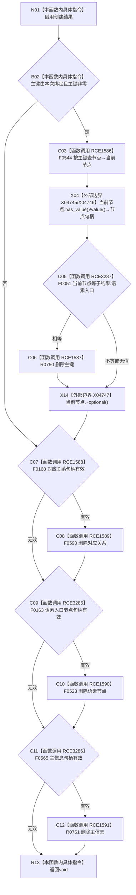

# CF-L6-0361 清理本次创建的语素入口现状流程图

图类型：现状流程图
代码版本：`0a93526882cb33c61c2fbb04ecad1aeaddcfe225`
工作区复核基线：`03a8b7ac099ccea83e57f2696e2290b7bcdfacaf`
源码 blob：`1355a1afd544cd44c14ee904246e9cb0778fb39b`
覆盖文件：`海中鱼巣/领域/语素服务.h:372-388`
唯一根函数：R0574
完整签名：`void 海中鱼巣::语素服务::清理本次创建的语素入口(const 语素入口创建结果& 结果)`
参数：`结果` 以 const 引用借用；函数只按其中的本次绑定标记、主键和三个句柄选择清理
返回结果：`void`；依次尝试删除仍指向本次入口的主键、对应关系、语素节点和主信息
已登记调用方：F0364（RCE0142）、R0573（RCE1582）
直接项目函数：F0544（RCE1586）、F0051（RCE3287）、R0750（RCE1587）、F0168（RCE1588）、F0590（RCE1589）、F0163（RCE3285）、F0523（RCE1590）、F0565（RCE3286）、R0761（RCE1591）
外部边界：X04745 `std::optional<节点句柄>::has_value`、X04746 `value`、X04747 `~optional`
逐行映射表：`流程图/代码流程图/L6/CF-L6-0361_清理本次创建的语素入口_逐行代码映射表.md`
结构读写：可删除本次主键绑定、关系、节点和主信息；各删除返回值未被读取
不得作为施工许可：是
不得宣称：函数返回代表所有删除均成功或不存在其它引用

## 流程图

## 当前边界

- 仅当索引当前仍指向本次语素入口时删除主键，避免清理其它节点的绑定。
- 项目调用边按实参数量和静态接收者绑定无令牌重载；X04745—X04747 覆盖局部 optional 的访问与作用域析构。
