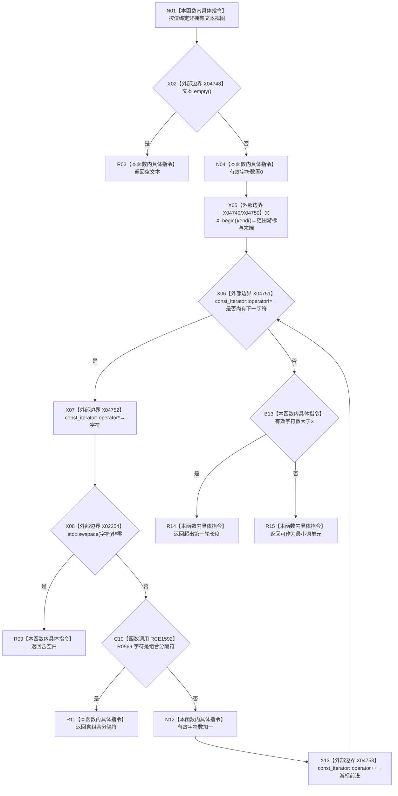

# CF-L6-0362 判断文本是否可作为最小词单元现状流程图

图类型：现状流程图
代码版本：`0a93526882cb33c61c2fbb04ecad1aeaddcfe225`
工作区复核基线：`03a8b7ac099ccea83e57f2696e2290b7bcdfacaf`
源码 blob：`1355a1afd544cd44c14ee904246e9cb0778fb39b`
覆盖文件：`海中鱼巣/领域/语素服务.h:57-75`
唯一根函数：R0575
完整签名：`语素准入状态 海中鱼巣::语素服务::判断文本是否可作为最小词单元(std::wstring_view 文本) const`
参数：`文本` 按值输入，为调用期间借用底层字符序列的非拥有视图
返回结果：依次返回空文本、含空白、含组合分隔符、超出第一轮长度或可作为最小词单元
已登记调用方：F0364（RCE0143）、R0241（RCE2564）
直接项目函数：R0569（RCE1592）
外部边界：X02254 `std::iswspace`、X04748 `std::wstring_view::empty`、X04749 `begin`、X04750 `end`、X04751 const_iterator `operator!=`、X04752 `operator*`、X04753 `operator++`
逐行映射表：`流程图/代码流程图/L6/CF-L6-0362_判断文本是否可作为最小词单元_逐行代码映射表.md`
结构读写：只读文本视图并维护局部有效字符计数
不得作为施工许可：是
不得宣称：准入成功代表语素入口、主信息、关系或索引已经创建

## 流程图

## 当前边界

- 空文本、首个空白或首个组合分隔符都会提前返回；长度上限在完整遍历后检查。
- 范围循环只统计未被前述条件拒绝的字符；`wstring_view` const 迭代器的比较、解引用和递增均为标准库边界，本函数不规范化 Unicode 组合字符。
