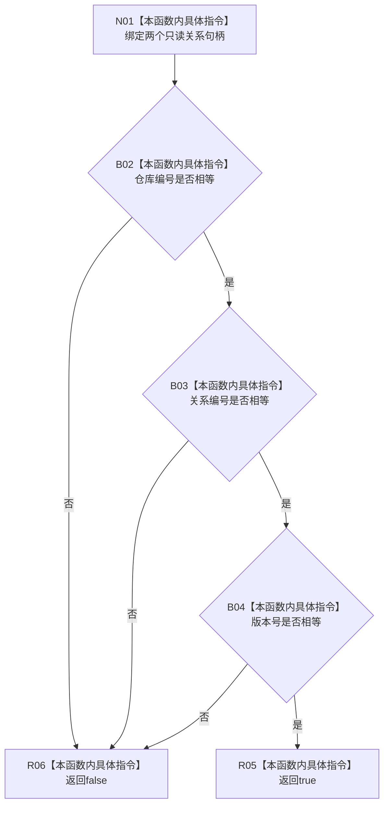

# CF-L6-0364 关系句柄相等比较现状流程图

图类型：现状流程图
代码版本：`03a8b7ac099ccea83e57f2696e2290b7bcdfacaf`
当前工作区复核基线：`7edb47f7b58aa71a10c225790e41f1d6c12a0cbd`
源码 blob：`5e48828f7fca6cb83a314852fed9a8c84d9fdd98`
覆盖文件：`海中鱼巣/核心/句柄.h:147-149`
唯一根函数：R0598
完整签名：`bool 海中鱼巣::operator==(const 海中鱼巣::关系句柄& 左, const 海中鱼巣::关系句柄& 右)`
参数：`左`、`右` 均为调用期只读借用
返回结果：仓库编号、关系编号和版本号三项全部相等时返回 `true`，否则返回 `false`
已登记调用方：F0361（RCE1674）、F0592（RCE1684）、F0457（RCE1768）、R0038（RCE2468）、R0441（RCE3008）、R0452（RCE3031）
直接项目函数：无
外部边界：无
逐行映射表：`流程图/代码流程图/L6/CF-L6-0364_关系句柄相等比较_逐行代码映射表.md`
结构读写：只读两个值式句柄，不修改项目结构
不得作为施工许可：是
不得宣称：句柄相等代表对应关系记录存在、有效或内容相同

## 流程图

## 当前边界

- 三项比较按源码 `&&` 从左到右短路。
- 本函数只比较值式身份字段，不读取关系仓库，也不判断关系版本是否仍为当前有效版本。
