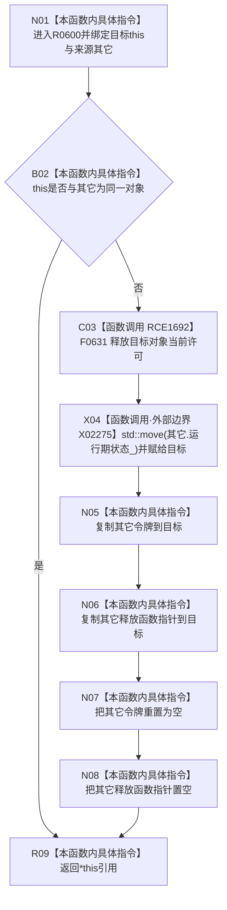

# CF-L6-0365 结构事务许可移动赋值现状流程图

图类型：现状流程图
代码版本：`03a8b7ac099ccea83e57f2696e2290b7bcdfacaf`
工作区复核基线：`29c275b9f3fe564bcaba896fb044fa271343614d`
源码 blob：`9d89cee25f00ba0f721d0b6c1bea517524e40663`
覆盖文件：`海中鱼巣/核心/结构事务接线.数据.h:29-39`
唯一根函数：R0600
完整签名：`海中鱼巣::结构事务许可& 海中鱼巣::结构事务许可::operator=(海中鱼巣::结构事务许可&& 其它) noexcept`
参数：`其它` 为右值引用；隐式 `this` 为目标许可对象，二者均由调用方保证存续
返回结果：自赋值时保持原状态；非自赋值时释放当前许可、接管其它对象状态并清空其它对象，最后返回 `*this`
已登记调用方：F0375（RCE1681）
直接项目函数：F0631（RCE1692）
外部边界：X02275 `std::move()`
逐行映射表：`流程图/代码流程图/L6/CF-L6-0365_结构事务许可移动赋值_逐行代码映射表.md`
结构读写：可能释放目标对象现有许可；移动运行期状态并复制令牌和释放函数指针；清空来源对象许可字段
逻辑内返回：自移动赋值直接返回当前对象
内部错误：函数声明 `noexcept`，无显式失败结果
生命周期与资源释放：非自赋值先调用 F0631；来源对象保留为空许可的可析构状态
不得作为施工许可：是
不得宣称：移动赋值创建了新许可、延长了令牌有效期或证明许可仍被协调器接受

## 流程图

## 当前边界

- 自移动赋值不调用释放，也不改写任一字段。
- 非自赋值先释放目标对象当前许可，再接管来源；源码没有在两步之间提供失败回滚。
- 运行期状态使用移动赋值，令牌和释放函数指针按值复制，随后显式清空来源许可字段。
