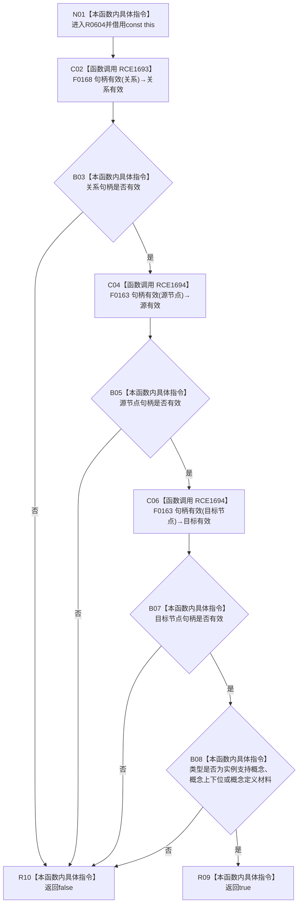

# CF-L6-0366 概念活动关系材料完整现状流程图

图类型：现状流程图
代码版本：`03a8b7ac099ccea83e57f2696e2290b7bcdfacaf`
工作区复核基线：`29c275b9f3fe564bcaba896fb044fa271343614d`
源码 blob：`dc4bd08f99622b3380c91dd15258fc8ab2e1b9c6`
覆盖文件：`海中鱼巣/领域/概念图服务.h:243-250`
唯一根函数：R0604
完整签名：`bool 海中鱼巣::概念活动关系材料::完整() const`
参数：无显式参数；隐式 const `this` 为调用期间有效的非拥有借用
返回结果：关系句柄、源节点和目标节点均有效，且关系类型属于三种允许类型时返回 `true`；否则按短路结果返回 `false`
已登记调用方：F0362（RCE1678）
直接项目函数：F0168（RCE1693，一次关系句柄检查）、F0163（RCE1694，两次节点句柄检查）
外部边界：无
逐行映射表：`流程图/代码流程图/L6/CF-L6-0366_概念活动关系材料完整_逐行代码映射表.md`
结构读写：只读材料四个字段；不修改关系、节点或概念活动结构
逻辑内返回：任一句柄无效或类型不在允许集合时返回 `false`
内部错误：无
不得作为施工许可：是
不得宣称：返回 `true` 证明关系记录仍存在、端点类型正确或关系已进入活动图

## 流程图

## 当前边界

- 四段条件按 `&&` 从左到右短路，类型判断仅在三个句柄均有效时执行。
- 允许类型内部按 `||` 短路，三种类型以外统一返回 false。
- 完整性只检查句柄值和类型枚举，不读回关系仓库记录。
