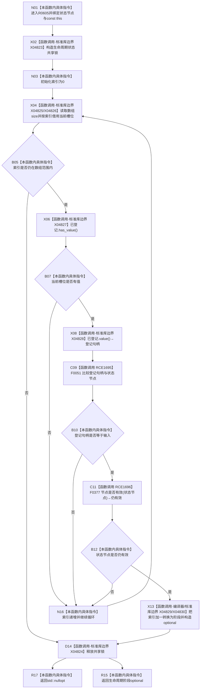

# CF-L6-0367 读取生命周期阶段已加锁现状流程图

图类型：现状流程图
代码版本：`03a8b7ac099ccea83e57f2696e2290b7bcdfacaf`
工作区复核基线：`29c275b9f3fe564bcaba896fb044fa271343614d`
源码 blob：`dc4bd08f99622b3380c91dd15258fc8ab2e1b9c6`
覆盖文件：`海中鱼巣/领域/概念图服务.h:3014-3025`
唯一根函数：R0605
完整签名：`std::optional<海中鱼巣::概念生命周期阶段> 海中鱼巣::概念图服务::读取生命周期阶段_已加锁(海中鱼巣::节点句柄 状态节点) const`
参数：`状态节点` 按值传入；隐式 const `this` 为调用期间有效的非拥有借用
返回结果：在生命周期状态数组中找到与输入相等且节点仓库仍判定有效的首个槽位时，返回索引加一转换出的阶段；否则返回 `std::nullopt`
已登记调用方：F0359（RCE1661）、F0360（RCE1670）
直接项目函数：F0051（RCE1695）、F0377（RCE1696）
外部边界：X04823/X04824 共享锁构造/析构；X04825/X04826 数组 `size()`/`operator[]`；X04827/X04828 optional `has_value()`/`value()`；X04829 阶段转换；X04830 optional 构造
逐行映射表：`流程图/代码流程图/L6/CF-L6-0367_读取生命周期阶段已加锁_逐行代码映射表.md`
结构读写：在共享锁保护下只读生命周期状态数组和节点有效性；不修改生命周期或节点结构
逻辑内返回：没有同时满足“槽位有值、句柄相等、节点仍有效”的记录时返回空 optional
内部错误：无
生命周期与资源释放：共享锁覆盖整个扫描并在成功或空结果返回前释放
不得作为施工许可：是
不得宣称：函数名中的“已加锁”表示调用方已持锁、返回阶段证明生命周期关系存在或多次读取属于同一快照

## 流程图

## 当前边界

- 函数内部实际构造共享锁；名称中的“已加锁”不代表调用方持锁。
- `&&` 从左到右短路：槽位无值时不取值，句柄不等时不调用 F0377。
- 阶段按数组索引加一形成；第一个匹配槽位立即返回，不继续检查重复登记。
