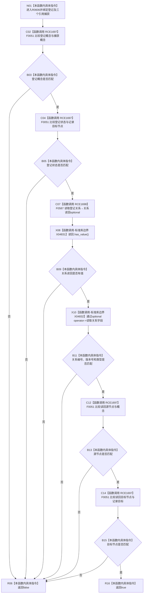

# CF-L6-0368 生命周期关系完整匹配谓词现状流程图

图类型：现状流程图
代码版本：`03a8b7ac099ccea83e57f2696e2290b7bcdfacaf`
工作区复核基线：`29c275b9f3fe564bcaba896fb044fa271343614d`
源码 blob：`dc4bd08f99622b3380c91dd15258fc8ab2e1b9c6`
覆盖文件：`海中鱼巣/领域/概念图服务.h:3078-3089`
唯一根函数：R0606
完整签名：`bool 海中鱼巣::概念图服务::确保概念生命周期_已加锁(...)::<lambda@概念图服务.h:3078-3089>::operator()(const 海中鱼巣::概念图清理准备包::生命周期关系登记材料& 登记) const`
参数：`登记` 为调用期间有效的只读非拥有借用；闭包只读借用 `this`、`记录` 和 `概念`
返回结果：登记概念、登记状态、关系读回编号、版本、类型、源节点和目标节点全部匹配时返回 `true`，否则按短路结果返回 `false`
已登记调用方：F0359 通过 `std::count_if`（RCE1662）
直接项目函数：F0051（RCE1697，节点句柄比较）、F0587（RCE1698，读取关系）
外部边界：X04831 optional `has_value()`；X04832 optional `operator->()` 五次
逐行映射表：`流程图/代码流程图/L6/CF-L6-0368_生命周期关系完整匹配谓词_逐行代码映射表.md`
结构读写：只读登记材料、既有关系记录和捕获的目标记录；不修改关系或生命周期登记
逻辑内返回：任一字段不匹配或关系读回为空时返回 `false`
内部错误：无；本谓词不记录诊断
生命周期与资源释放：捕获均为引用，只在外层算法调用期间有效；读回 optional 为局部值
不得作为施工许可：是
不得宣称：返回 `true` 证明登记唯一、关系仍处于发布状态或生命周期整体一致

## 流程图

## 当前边界

- 条件按 `||` / `&&` 从左到右短路；概念或状态不匹配时不会读取关系。
- 关系读回有值后依次比较编号、版本、类型、源节点和目标节点。
- 本谓词由 `count_if` 零到多次调用，只判断单项完整匹配，不判断匹配数量是否唯一。
