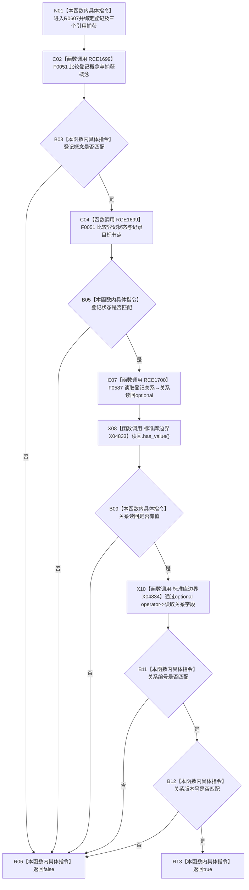

# CF-L6-0369 生命周期关系编号版本匹配谓词现状流程图

图类型：现状流程图
代码版本：`03a8b7ac099ccea83e57f2696e2290b7bcdfacaf`
工作区复核基线：`29c275b9f3fe564bcaba896fb044fa271343614d`
源码 blob：`dc4bd08f99622b3380c91dd15258fc8ab2e1b9c6`
覆盖文件：`海中鱼巣/领域/概念图服务.h:3095-3103`
唯一根函数：R0607
完整签名：`bool 海中鱼巣::概念图服务::确保概念生命周期_已加锁(...)::<lambda@概念图服务.h:3095-3103>::operator()(const 海中鱼巣::概念图清理准备包::生命周期关系登记材料& 登记) const`
参数：`登记` 为调用期间有效的只读非拥有借用；闭包只读借用 `this`、`记录` 和 `概念`
返回结果：登记概念、登记状态、关系读回编号和版本全部匹配时返回 `true`，否则按短路结果返回 `false`
已登记调用方：F0359 通过 `std::find_if`（RCE1663）
直接项目函数：F0051（RCE1699，节点句柄比较）、F0587（RCE1700，读取关系）
外部边界：X04833 optional `has_value()`；X04834 optional `operator->()` 两次
逐行映射表：`流程图/代码流程图/L6/CF-L6-0369_生命周期关系编号版本匹配谓词_逐行代码映射表.md`
结构读写：只读登记材料和既有关系记录；不修改关系或生命周期登记
逻辑内返回：任一字段不匹配或关系读回为空时返回 `false`
内部错误：无；本谓词不记录诊断
生命周期与资源释放：捕获均为引用，只在外层算法调用期间有效；读回 optional 为局部值
不得作为施工许可：是
不得宣称：返回 `true` 证明关系类型和端点仍匹配、登记唯一或生命周期整体一致

## 流程图

## 当前边界

- 概念或状态不匹配时不会读取关系；关系读回为空时不会读取字段。
- 本谓词只比较关系编号和版本，不复核关系类型、源节点或目标节点。
- `find_if` 在首个 true 时停止，本函数不判断是否还存在其它匹配登记。
