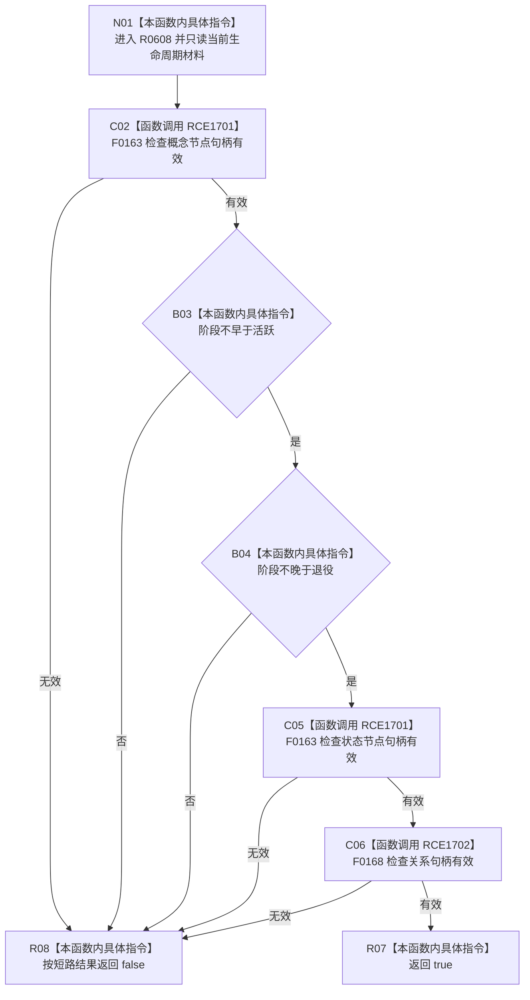

# CF-L6-0370 概念生命周期材料完整现状流程图

图类型：现状流程图
代码版本：`03a8b7ac099ccea83e57f2696e2290b7bcdfacaf`
工作区复核基线：`29c275b9f3fe564bcaba896fb044fa271343614d`
源码 blob：`dc4bd08f99622b3380c91dd15258fc8ab2e1b9c6`
覆盖文件：`海中鱼巣/领域/概念图服务.h:55-61`
唯一根函数：R0608
完整签名：`bool 海中鱼巣::概念生命周期材料::完整() const`
参数：无显式参数；只读当前概念生命周期材料
返回结果：概念句柄有效、阶段位于活跃至退役闭区间、状态句柄有效且关系句柄有效时返回 `true`，否则按 `&&` 短路返回 `false`
已登记调用方：F0360（RCE1673）
直接项目函数：F0163（RCE1701，概念与状态两个调用点）、F0168（RCE1702）
外部边界：无
逐行映射表：`流程图/代码流程图/L6/CF-L6-0370_概念生命周期材料完整_逐行代码映射表.md`
结构读写：只读当前材料的概念、阶段、状态和关系字段，不改变机器结构
不得作为施工许可：是
不得宣称：材料完整代表生命周期关系符合全部规范、对应结构已经发布或能力已经完成

## 流程图

## 当前边界

- 阶段仅按枚举顺序检查闭区间，不在本函数内读取或验证阶段关系。
- `&&` 保证前置不成立时不执行后续句柄检查；本函数不产生诊断或结构写入。
