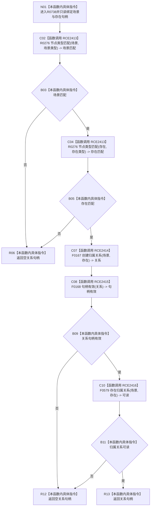

# CF-L6-0371 场景服务接纳存在现状流程图

图类型：现状流程图
代码版本：`03a8b7ac099ccea83e57f2696e2290b7bcdfacaf`
当前工作区复核基线：`8632fb891fb3beea255aff1946c07b0fe975ef2b`
源码 blob：`ae4a5c34a3a725f7b2cd53e994ed0bec655a36b5`
覆盖文件：`海中鱼巣/领域/场景服务.h:27-36`
唯一根函数：R0738
完整签名：`海中鱼巣::关系句柄 海中鱼巣::场景服务::接纳存在(海中鱼巣::节点句柄 场景, 海中鱼巣::节点句柄 存在)`
参数：`场景`、`存在` 均为值传递节点句柄；函数不取得其生命周期所有权
返回结果：类型与关系均复核成功时返回归属关系句柄；任一检查失败返回空关系句柄
调用图：`流程图/主程序可达调用关系/00_main可达函数身份表.md`、`01_main可达项目调用边表.md`、`02_main可达外部边界表.md`
已登记调用方：R0736、R0847
直接项目函数：R0276（RCE2413，两次）、F0167（RCE2414）、F0168（RCE2415）、F0579（RCE2416）
外部边界：无
逐行映射表：`流程图/代码流程图/L6/CF-L6-0371_场景服务接纳存在_逐行代码映射表.md`
输入契约 / 调用语境表：本图内嵌审查；两个句柄来自场景接纳调用方，函数自行核对类型
非成功返回二分审查表：本图内嵌审查；类型不匹配、关系句柄无效或关系不可读均返回空句柄
偏差清单：无独立文件；本批只记录当前代码事实
依据提交 / 结构化消息：冻结源码提交 `03a8b7ac099ccea83e57f2696e2290b7bcdfacaf` 与正式身份、调用边表
验证输出：Mermaid / 节点集合 / 逐行覆盖 PASS；目标 no-index 与全仓 diff 检查 PASS；strict 108/108 PASS；未构建、未运行
不得作为施工许可：是
不得宣称：返回非空关系已经完成本函数之外的业务验收或持久化读回

## 流程图

## 当前边界

- 本函数只核对节点类型和创建后关系存在性；不展开被调仓库函数的内部事务与存储路径。
