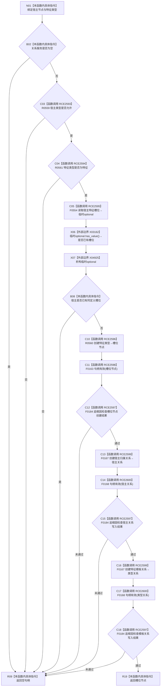

# CF-L6-0372 创建实例特征槽位现状流程图

图类型：现状流程图
代码版本：`03a8b7ac099ccea83e57f2696e2290b7bcdfacaf`
当前工作区复核基线：`ef4f7bda76c92c0eb11456cfa267d76f35810616`
源码 blob：`4c7bcd451f2e46e85d707a40c371dcbeaa2c1169`
覆盖文件：`海中鱼巣/领域/特征服务.h:242-260`
唯一根函数：R0762
完整签名：`节点句柄 海中鱼巣::特征服务::创建实例特征槽位(节点句柄 宿主节点, 节点句柄 特征类型)`
参数：`宿主节点`、`特征类型` 均按值输入；关系服务须已接入，宿主类型须允许，特征类型须为特征，且宿主不得已有同定义槽位
返回结果：入口不满足或任一步创建/检查失败返回空句柄；全部成功时返回新建槽位节点
已登记调用方：R0249、R0847（RCE2569、RCE3135）
直接项目函数：R0559、R0561、F0554、R0560、F0184、F0163、F0167、F0168（RCE2593—RCE2600）
外部边界：X03162 `std::optional<节点句柄>::has_value()`；X04925 临时 `std::optional<节点句柄>` 析构
逐行映射表：`流程图/代码流程图/L6/CF-L6-0372_创建实例特征槽位_逐行代码映射表.md`
结构读写：入口检查只读宿主与特征结构；通过后创建槽位节点、宿主归属关系和特征模板关系
不得作为施工许可：是
不得宣称：返回空句柄时本函数必然没有留下已创建节点或关系

## 流程图

## 当前边界

- 第 243—244 行按 `||` 从左到右短路；只有前三项均不拒绝时才读取已有槽位，X04925 在该完整表达式末释放临时 optional。
- 节点创建、宿主关系创建或模板关系创建未达预期时 F0184 记录追根因结果；本函数没有撤销此前成功创建的节点或关系。
