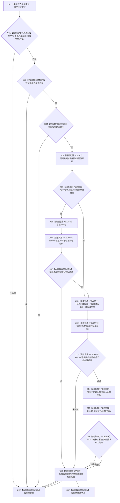

# CF-L6-0373 创建特征值现状流程图

图类型：现状流程图
代码版本：`03a8b7ac099ccea83e57f2696e2290b7bcdfacaf`
当前工作区复核基线：`ef4f7bda76c92c0eb11456cfa267d76f35810616`
源码 blob：`4c7bcd451f2e46e85d707a40c371dcbeaa2c1169`
覆盖文件：`海中鱼巣/领域/特征服务.h:333-354`
唯一根函数：R0763
完整签名：`节点句柄 海中鱼巣::特征服务::创建特征值(节点句柄 特征节点)`
参数：`特征节点` 按值输入；须匹配特征类型，且特征值服务与关系服务均已接入
返回结果：入口不满足、实例槽位已有当前值或任一步创建/检查失败时返回空句柄；成功时返回新建特征值节点
已登记调用方：R0249、R0847（RCE2570、RCE3136）
直接项目函数：R0776、R0778、R0777、R0782、F0184、F0163、F0167、F0168（RCE2601—RCE2608）
外部边界：X03163 `std::unique_lock<std::mutex>` 延迟加锁构造；X03164 `lock()`；X03165 `~unique_lock()`
逐行映射表：`流程图/代码流程图/L6/CF-L6-0373_创建特征值_逐行代码映射表.md`
结构读写：可读取实例槽位当前值；成功路径创建特征值节点及其到特征节点的归属关系
不得作为施工许可：是
不得宣称：返回空句柄时本函数必然没有留下新建特征值节点

## 流程图

## 当前边界

- 写锁以 `std::defer_lock` 构造，仅当特征节点是实例特征槽位时加锁并读取当前值；非实例槽位路径保持未加锁。
- X03165 覆盖构造后的所有正常返回路径；已加锁时释放互斥量，未加锁时只结束锁对象生命周期。
- 归属关系创建未达预期时，本函数返回空句柄但不撤销已成功创建的特征值节点。
