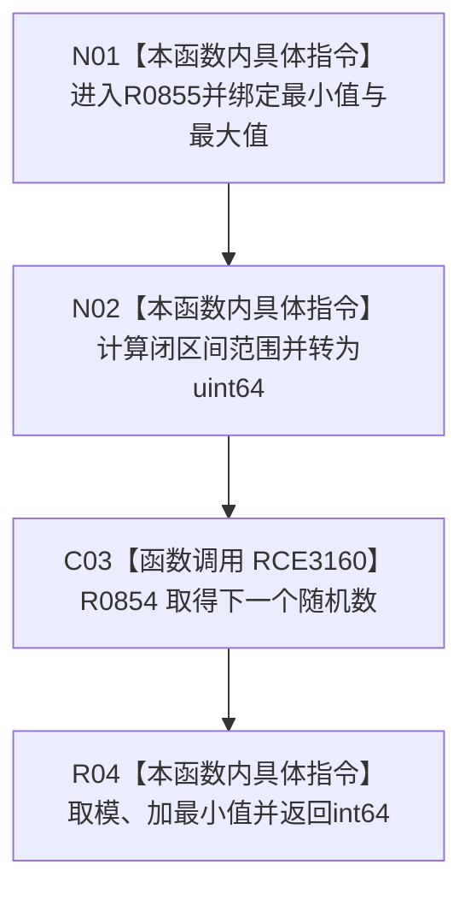

# CF-L6-0374 生成有符号值现状流程图

图类型：现状流程图
代码版本：`03a8b7ac099ccea83e57f2696e2290b7bcdfacaf`
当前工作区复核基线：`4e0ac10ae3b18404ff2b623faa0fb006fa0fc7a1`
源码 blob：`59de05d5ba3594942c819c9ec50e3d0ebc6cb9bd`
覆盖文件：`海中鱼巣/自检.入口初始化.ixx:526-529`
唯一根函数：R0855
完整签名：`std::int64_t 海中鱼巣::运行自我场景多存在特征状态自检(const 海中鱼巣::入口初始化自检运行配置&)::<lambda@自检.入口初始化.ixx:526>::operator()(std::int64_t 最小值, std::int64_t 最大值) const`
参数：有符号最小值与最大值按值；当前调用均保证最小值不大于最大值且范围可表示
返回结果：闭区间内的确定性伪随机 int64 值
调用图：正式 main 可达关系表
已登记调用方：R0847（RCE3133）
直接项目函数：R0854（RCE3160）
外部边界：无
逐行映射表：`流程图/代码流程图/L6/CF-L6-0374_生成有符号值_逐行代码映射表.md`
不得作为施工许可：是
不得宣称：函数对任意上下界均无溢出或除零风险

## 流程图

## 当前边界

- 当前调用参数均为固定自检范围；本函数没有独立非法参数拒绝。
