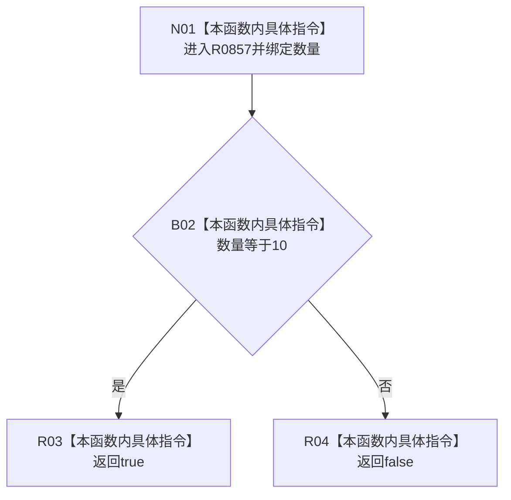

# CF-L6-0376 状态数量匹配谓词现状流程图

图类型：现状流程图
代码版本：`03a8b7ac099ccea83e57f2696e2290b7bcdfacaf`
当前工作区复核基线：`4e0ac10ae3b18404ff2b623faa0fb006fa0fc7a1`
源码 blob：`59de05d5ba3594942c819c9ec50e3d0ebc6cb9bd`
覆盖文件：`海中鱼巣/自检.入口初始化.ixx:643`
唯一根函数：R0857
完整签名：`bool 海中鱼巣::运行自我场景多存在特征状态自检(const 海中鱼巣::入口初始化自检运行配置&)::<lambda@自检.入口初始化.ixx:643>::operator()(std::size_t 数量) const`
参数：状态计数按值
返回结果：数量等于固定每个存在状态数量 10 时返回 true，否则 false
调用图：正式 main 可达关系表
已登记调用方：R0847（RCE3146，经 std::all_of）
直接项目函数：无
外部边界：无
逐行映射表：`流程图/代码流程图/L6/CF-L6-0376_状态数量匹配谓词_逐行代码映射表.md`
不得作为施工许可：是
不得宣称：true 证明十项状态内容、版本或因果关系正确

## 流程图

## 当前边界

- 本谓词只比较计数，不读取任何状态材料。
