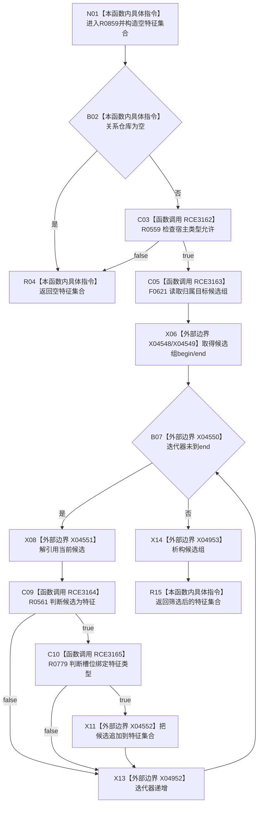

# CF-L6-0377 读取宿主特征集合现状流程图

图类型：现状流程图
代码版本：`03a8b7ac099ccea83e57f2696e2290b7bcdfacaf`
当前工作区复核基线：`4e0ac10ae3b18404ff2b623faa0fb006fa0fc7a1`
源码 blob：`4c7bcd451f2e46e85d707a40c371dcbeaa2c1169`
覆盖文件：`海中鱼巣/领域/特征服务.h:275-287`
唯一根函数：R0859
完整签名：`std::vector<海中鱼巣::节点句柄> 海中鱼巣::特征服务::读取宿主特征集合(海中鱼巣::节点句柄 宿主节点) const`
参数：宿主节点句柄按值
返回结果：返回归属于宿主、节点为特征且绑定至少一个特征类型的槽位集合；前置失败或无候选时为空集合
调用图：`流程图/主程序可达调用关系/00_main可达函数身份表.md`、`01_main可达项目调用边表.md`、`02_main可达外部边界表.md`
已登记调用方：R0847（RCE3141）
直接项目函数：R0559（RCE3162）、F0621（RCE3163）、R0561（RCE3164）、R0779（RCE3165）
外部边界：X04548—X04552、X04952—X04953
逐行映射表：`流程图/代码流程图/L6/CF-L6-0377_读取宿主特征集合_逐行代码映射表.md`
不得作为施工许可：是
不得宣称：返回集合证明每个槽位只绑定唯一特征定义或当前值完整

## 流程图

## 当前边界

- 候选顺序沿关系仓库返回顺序保留；本函数不去重、不排序，也不要求特征类型绑定唯一。
