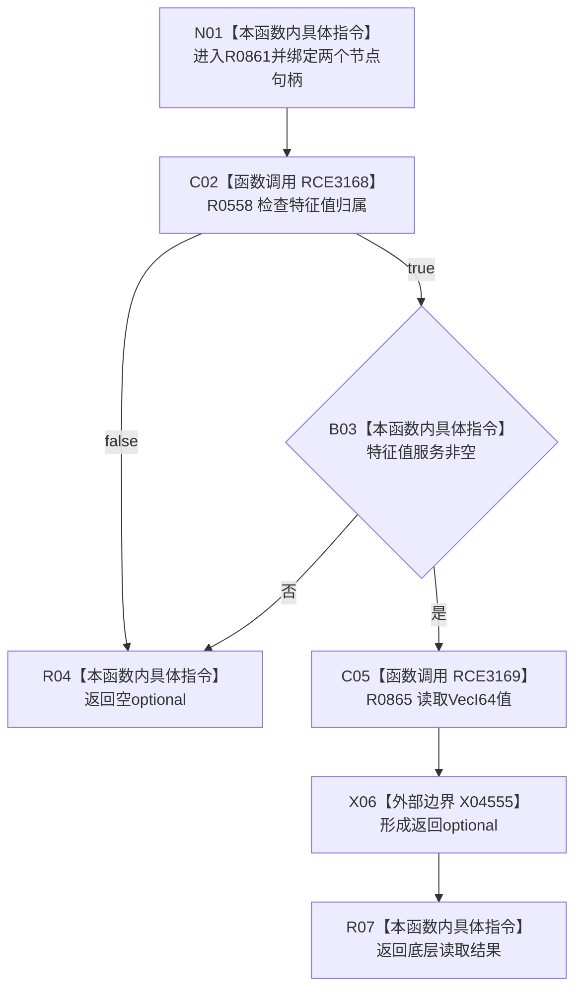

# CF-L6-0379 读取 VecI64 特征值现状流程图

图类型：现状流程图
代码版本：`03a8b7ac099ccea83e57f2696e2290b7bcdfacaf`
当前工作区复核基线：`4e0ac10ae3b18404ff2b623faa0fb006fa0fc7a1`
源码 blob：`4c7bcd451f2e46e85d707a40c371dcbeaa2c1169`
覆盖文件：`海中鱼巣/领域/特征服务.h:383-390`
唯一根函数：R0861
完整签名：`std::optional<std::vector<std::int64_t>> 海中鱼巣::特征服务::读取VecI64特征值(海中鱼巣::节点句柄 特征节点, 海中鱼巣::节点句柄 特征值节点) const`
参数：特征节点和特征值节点按值
返回结果：归属成立且服务存在时返回底层 VecI64 optional，否则空 optional
调用图：正式 main 可达关系表
已登记调用方：R0847（RCE3139）
直接项目函数：R0558（RCE3168）、R0865（RCE3169）
外部边界：X04555
逐行映射表：`流程图/代码流程图/L6/CF-L6-0379_读取VecI64特征值_逐行代码映射表.md`
不得作为施工许可：是
不得宣称：含值结果证明同一事务版本或上层槽位当前性

## 流程图

## 当前边界

- 本函数不验证非空向量或序列上限；这些由底层材料合同承担。
