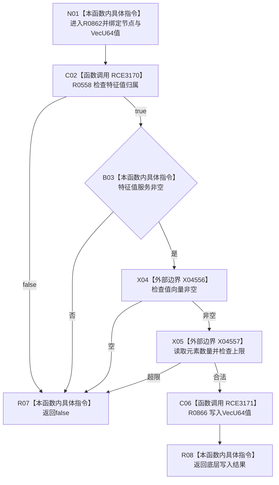

# CF-L6-0380 写入 VecU64 特征值现状流程图

图类型：现状流程图
代码版本：`03a8b7ac099ccea83e57f2696e2290b7bcdfacaf`
当前工作区复核基线：`4e0ac10ae3b18404ff2b623faa0fb006fa0fc7a1`
源码 blob：`4c7bcd451f2e46e85d707a40c371dcbeaa2c1169`
覆盖文件：`海中鱼巣/领域/特征服务.h:392-403`
唯一根函数：R0862
完整签名：`bool 海中鱼巣::特征服务::写入VecU64特征值(海中鱼巣::节点句柄 特征节点, 海中鱼巣::节点句柄 特征值节点, const std::vector<std::uint64_t>& 值)`
参数：特征节点、特征值节点按值；值向量为调用期间有效的只读借用
返回结果：归属、服务、非空与最大数量前置均满足时返回底层写入结果，否则 false
调用图：正式 main 可达关系表
已登记调用方：R0847（RCE3138）
直接项目函数：R0558（RCE3170）、R0866（RCE3171）
外部边界：X04556、X04557
逐行映射表：`流程图/代码流程图/L6/CF-L6-0380_写入VecU64特征值_逐行代码映射表.md`
不得作为施工许可：是
不得宣称：true 证明写入已经形成上层特征状态或独立事务读回

## 流程图

## 当前边界

- 前置失败发生在底层值写入前；底层写入事务、版本和错误语义由 R0866 承担。
