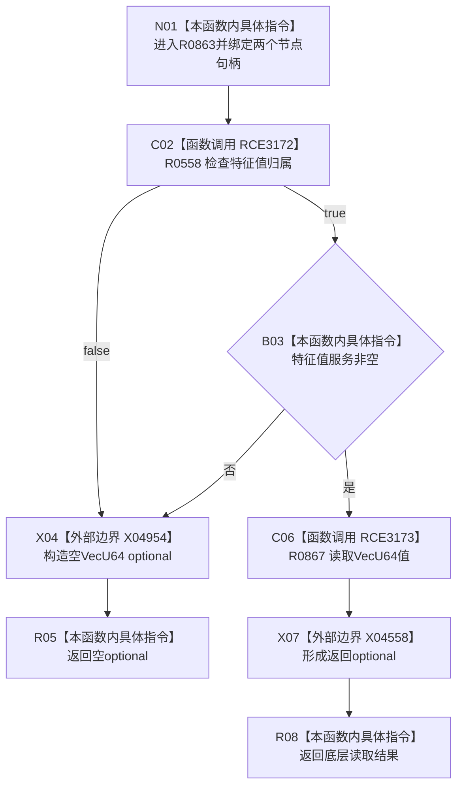

# CF-L6-0381 读取 VecU64 特征值现状流程图

图类型：现状流程图
代码版本：`03a8b7ac099ccea83e57f2696e2290b7bcdfacaf`
当前工作区复核基线：`00d917a5cf09998d2ab14d9239e1c194b5593ff0`
源码 blob：`4c7bcd451f2e46e85d707a40c371dcbeaa2c1169`
覆盖文件：`海中鱼巣/领域/特征服务.h:405-412`
唯一根函数：R0863
完整签名：`std::optional<std::vector<std::uint64_t>> 海中鱼巣::特征服务::读取VecU64特征值(海中鱼巣::节点句柄 特征节点, 海中鱼巣::节点句柄 特征值节点) const`
参数：特征节点、特征值节点按值
返回结果：归属成立且特征值服务存在时返回底层 VecU64 optional，否则返回空 optional
调用图：正式 main 可达关系表
已登记调用方：R0847（RCE3140）
直接项目函数：R0558（RCE3172）、R0867（RCE3173）
外部边界：X04558、X04954
逐行映射表：`流程图/代码流程图/L6/CF-L6-0381_读取VecU64特征值_逐行代码映射表.md`
不得作为施工许可：是
不得宣称：含值结果证明同一事务版本或上层槽位当前性

## 流程图

## 当前边界

- 本函数只核对归属与服务指针；底层节点、事务许可、原始类型和内部一致性由 R0867 负责。
