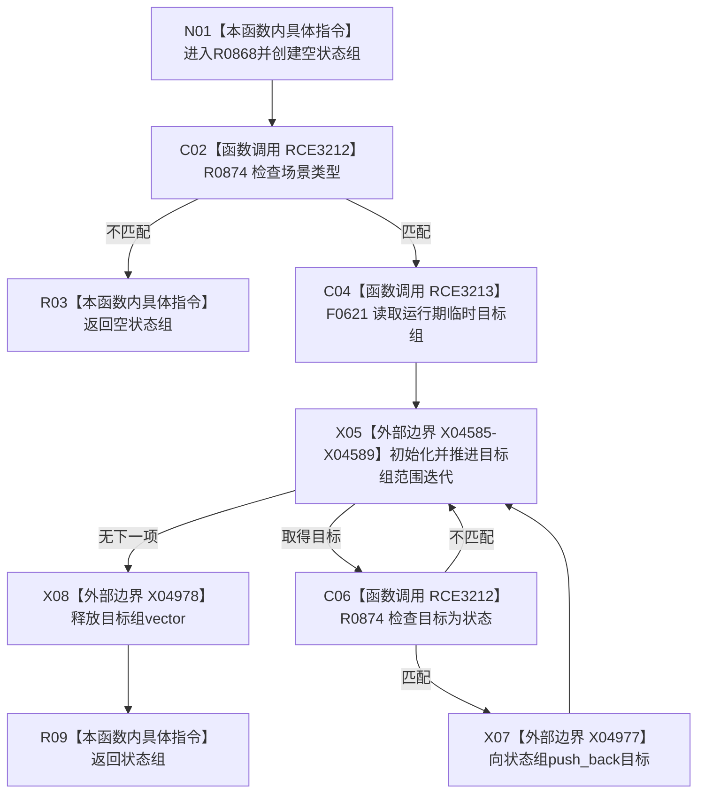

# CF-L6-0382 状态服务读取场景状态现状流程图

图类型：现状流程图
代码版本：`03a8b7ac099ccea83e57f2696e2290b7bcdfacaf`
当前工作区复核基线：`00d917a5cf09998d2ab14d9239e1c194b5593ff0`
源码 blob：`5b6bb9defda124496de99899621a9e4ab2dac179`
覆盖文件：`海中鱼巣/领域/状态服务.h:225-237`
唯一根函数：R0868
完整签名：`std::vector<海中鱼巣::节点句柄> 海中鱼巣::状态服务::读取场景状态(海中鱼巣::节点句柄 场景) const`
参数：场景句柄按值；只读节点与关系仓库
返回结果：场景类型无效时返回空组；否则返回运行期临时目标中类型为状态的节点组
调用图：正式 main 可达关系表
已登记调用方：R0847（RCE3142）
直接项目函数：R0874（RCE3212，调用点第 227、232 行）、F0621（RCE3213）
外部边界：X04585—X04589、X04977、X04978
逐行映射表：`流程图/代码流程图/L6/CF-L6-0382_状态服务读取场景状态_逐行代码映射表.md`
不得作为施工许可：是
不得宣称：返回组已经按状态时间、版本或其它业务顺序排序

## 流程图

## 当前边界

- RCE3212 在当前源码实际调用两次：第 227 行检查场景，第 232 行筛选状态目标。
