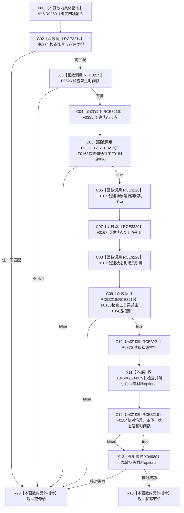

# CF-L6-0383 状态服务创建实例状态现状流程图

图类型：现状流程图
代码版本：`03a8b7ac099ccea83e57f2696e2290b7bcdfacaf`
当前工作区复核基线：`00d917a5cf09998d2ab14d9239e1c194b5593ff0`
源码 blob：`5b6bb9defda124496de99899621a9e4ab2dac179`
覆盖文件：`海中鱼巣/领域/状态服务.h:132-155`
唯一根函数：R0869
完整签名：`海中鱼巣::节点句柄 海中鱼巣::状态服务::创建实例状态(海中鱼巣::节点句柄 场景, 海中鱼巣::节点句柄 存在, std::uint64_t 发生时间戳, std::int64_t 状态值)`
参数：场景、存在句柄及发生时间戳、状态值均按值
返回结果：前置、节点创建、三条关系写入和材料读回全部成立时返回状态节点，否则返回空句柄
调用图：正式 main 可达关系表
已登记调用方：R0847（RCE3143）
直接项目函数：R0874（RCE3214）、F0626（RCE3215）、F0335（RCE3216）、F0163（RCE3217）、F0168（RCE3218）、F0184（RCE3219）、F0167（RCE3220）、R0870（RCE3221）
外部边界：X04590、X04979、X04980
逐行映射表：`流程图/代码流程图/L6/CF-L6-0383_状态服务创建实例状态_逐行代码映射表.md`
不得作为施工许可：是
不得宣称：失败分支会撤销此前已创建的状态节点或关系

## 流程图

## 当前边界

- 状态节点、三条关系或读回失败时，本函数直接返回空句柄，不在本函数内撤销已形成结构。
