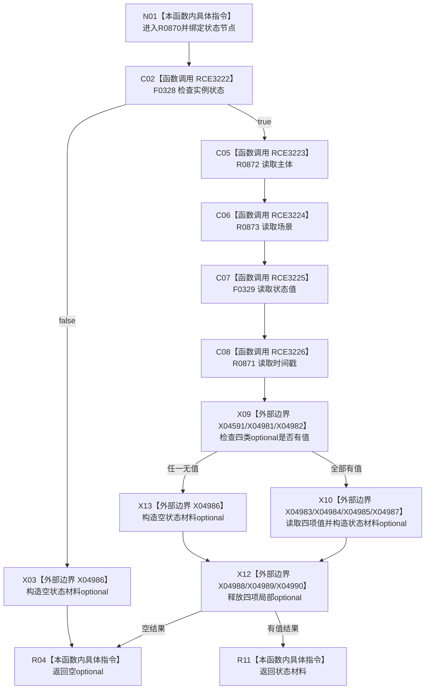

# CF-L6-0384 状态服务读取状态材料现状流程图

图类型：现状流程图
代码版本：`03a8b7ac099ccea83e57f2696e2290b7bcdfacaf`
当前工作区复核基线：`00d917a5cf09998d2ab14d9239e1c194b5593ff0`
源码 blob：`5b6bb9defda124496de99899621a9e4ab2dac179`
覆盖文件：`海中鱼巣/领域/状态服务.h:239-251`
唯一根函数：R0870
完整签名：`std::optional<海中鱼巣::状态材料> 海中鱼巣::状态服务::读取状态材料(海中鱼巣::节点句柄 状态节点) const`
参数：状态节点按值；只读状态、关系、主信息
返回结果：实例状态及主体、场景、状态值、时间戳四项材料均存在时返回状态材料 optional，否则空 optional
调用图：正式 main 可达关系表
已登记调用方：R0847（RCE3145）、R0869（RCE3221）
直接项目函数：F0328（RCE3222）、R0872（RCE3223）、R0873（RCE3224）、F0329（RCE3225）、R0871（RCE3226）
外部边界：X04591、X04981—X04990
逐行映射表：`流程图/代码流程图/L6/CF-L6-0384_状态服务读取状态材料_逐行代码映射表.md`
不得作为施工许可：是
不得宣称：空 optional 可区分实例前置、引用唯一性、状态值或时间戳缺失

## 流程图

## 当前边界

- 四项读取结果在本函数内汇合；任一缺失均折叠为空 optional，不保留缺失项身份。
