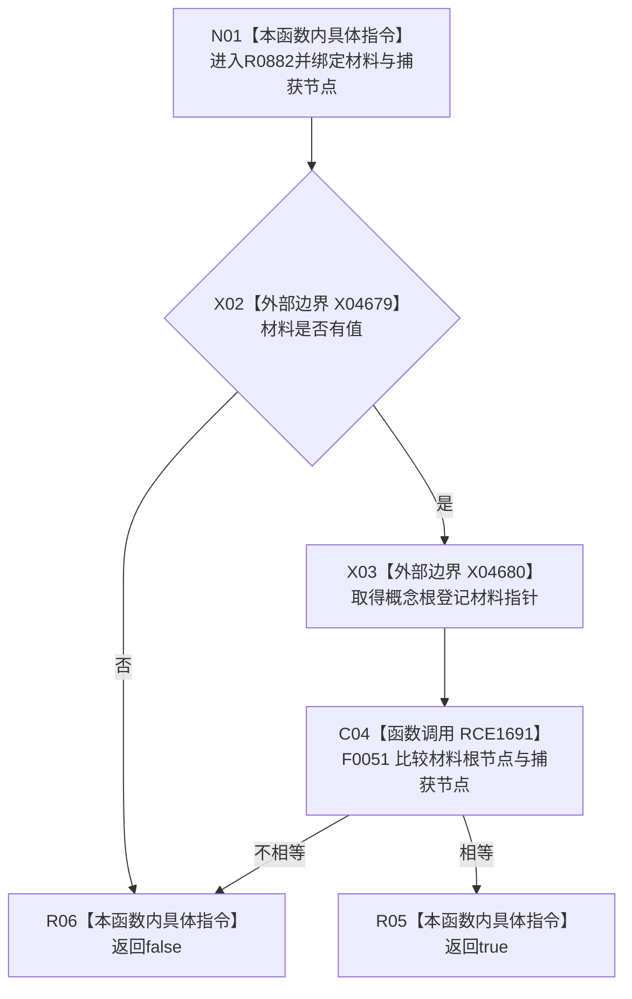

# CF-L6-0385 概念根登记匹配谓词现状流程图

图类型：现状流程图
代码版本：`03a8b7ac099ccea83e57f2696e2290b7bcdfacaf`
当前工作区复核基线：`00d917a5cf09998d2ab14d9239e1c194b5593ff0`
源码 blob：`dc4bd08f99622b3380c91dd15258fc8ab2e1b9c6`
覆盖文件：`海中鱼巣/领域/概念图服务.h:921-923`
唯一根函数：R0882
完整签名：`bool 海中鱼巣::概念图服务::节点是否已登记概念根(海中鱼巣::节点句柄 节点) const::<lambda@概念图服务.h:921>::operator()(const std::optional<海中鱼巣::概念根登记材料>& 材料) const`
参数：`材料` 为调用期间有效的只读 optional 借用；外层捕获的 `节点` 为只读引用
返回结果：材料有值且其根节点等于捕获节点时返回 true，否则 false
调用图：正式 main 可达关系表
已登记调用方：R0531（RCE3263，经 `std::any_of`）
直接项目函数：F0051（RCE1691）
外部边界：X04679、X04680
逐行映射表：`流程图/代码流程图/L6/CF-L6-0385_概念根登记匹配谓词_逐行代码映射表.md`
不得作为施工许可：是
不得宣称：true 证明概念根登记材料的其它字段或外层登记集合整体有效

## 流程图

## 当前边界

- 本谓词只判断 optional 存在性和根节点相等，不修改登记材料或根登记集合。
