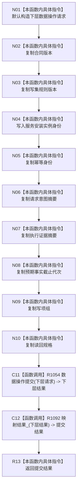

# CF-L6-0407 提交现状流程图

图类型：现状流程图
代码版本：`4b80f1617dd70ec7a19e1a34efa9da768dce8927`
源码 blob：`81436fae9c0952071918e5353ece369150ec1fef`
覆盖文件：`海中鱼巣/核心/服务.节点直接类型化结构提交.ixx:36-49`
唯一根函数：R1091
完整签名：`节点直接类型化结构提交结果 海中鱼巣::节点直接类型化结构提交服务::提交(const 节点直接类型化结构事务请求& 请求) const`
参数：请求为调用期只读借用；服务持有安装实例身份副本和数据操作非拥有引用
返回结果：下层数据操作结果经 R1092 映射后的提交结果
调用图：R1091 -> R1054（数据操作提交）-> R1092（结果映射）
逐行映射表：`流程图/代码流程图/L6/CF-L6-0407_提交_逐行代码映射表.md`
输入契约 / 调用语境表：R1118 自检路径提交类型化结构事务请求
非成功返回二分审查表：入口拒绝、幂等冲突、版本漂移和许可拒绝由下层结构化结果映射；内部不一致保持内部错误语义
偏差清单：无
依据提交 / 结构化消息：`4b80f161`
验证输出：本批仅文档机械验证
不得作为施工许可：是
不得宣称：返回 DTO 映射代表持久证据、业务接线或世界结构能力完成

## 流程图

## 当前边界

- 本函数只完成 DTO 投影、下层提交调用和结果映射；事务原子性、发布与撤销由 R1054 的下层调用子图承担。
