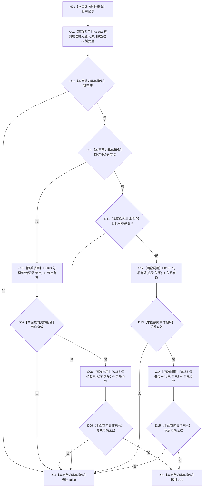

# CF-L6-0439 可重建索引记录完整现状流程图

图类型：现状流程图
代码版本：`4b80f1617dd70ec7a19e1a34efa9da768dce8927`；在 HEAD `466d1ab0272ebb122203354a2a1e7be893db964a` 复核目标源码 blob 未变
源码 blob：`e2d8ebd62dc85563118b4fe246377d5445bf977c`
覆盖文件：`海中鱼巣/核心/仓库.可重建索引.ixx:38-45`
唯一根函数：R1155
完整签名：`bool 海中鱼巣::可重建索引记录完整(const 可重建索引记录& 记录) noexcept`
参数：`记录` 为调用期只读借用；函数不取得所有权
返回结果：物理键完整，且节点目标只持有有效节点句柄、关系目标只持有有效关系句柄时返回 `true`；其余返回 `false`
调用图：R1155 -> R1292（39）；R1155 -> F0163 / F0168（41、44，按目标种类和短路条件调用）
逐行映射表：`流程图/代码流程图/L6/CF-L6-0439_可重建索引记录完整_逐行代码映射表.md`
输入契约 / 调用语境表：R1163、R1172、R1174、R1487、R1492 以入口记录、恢复材料或已发布记录调用；`false` 的上层口径随调用语境决定
非成功返回二分审查表：入口候选不完整时 `false` 是逻辑内拒绝；正式恢复材料或已发布记录本应完整而得到 `false` 时应追根因
偏差清单：正式边表 RCE4086、RCE4143、RCE4144 的调用点集合与 38-45 行源码不完全一致，待共享图谱所有者修正
依据提交 / 结构化消息：`4b80f161` 图谱基线；`466d1ab0` 目标文件零漂移复核
验证输出：本批仅源码逐行与 Markdown 机械验证
不得作为施工许可：是
不得宣称：记录完整代表目标已发布、权威可读或索引已经建立

## 流程图

## 当前边界

- 本函数只做记录形态谓词判断，不读取权威节点、关系或索引仓库，也不改变结构。
- `&&` 按短路规则执行，因此第二个句柄检查只在前项成立时发生。
