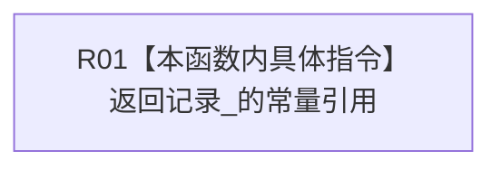

# CF-L6-0440 读取记录现状流程图

图类型：现状流程图
代码版本：`4b80f1617dd70ec7a19e1a34efa9da768dce8927`；在 HEAD `466d1ab0272ebb122203354a2a1e7be893db964a` 复核目标源码 blob 未变
源码 blob：`e2d8ebd62dc85563118b4fe246377d5445bf977c`
覆盖文件：`海中鱼巣/核心/仓库.可重建索引.ixx:83`
唯一根函数：R1157
完整签名：`const 可重建索引记录& 海中鱼巣::可重建索引候选::读取记录() const noexcept`
参数：隐式 `this` 为只读借用；无显式参数
返回结果：返回候选内部 `记录_` 的常量引用；引用生命周期不超过候选对象
调用图：R1249 -> R1157；R1157 无直接被调函数
逐行映射表：`流程图/代码流程图/L6/CF-L6-0440_读取记录_逐行代码映射表.md`
输入契约 / 调用语境表：会话读取索引物理键时读取当前候选记录
非成功返回二分审查表：无显式非成功返回
偏差清单：无
依据提交 / 结构化消息：`4b80f161` 图谱基线；`466d1ab0` 目标文件零漂移复核
验证输出：本批仅源码逐行与 Markdown 机械验证
不得作为施工许可：是
不得宣称：返回记录引用代表索引记录已发布或权威可读

## 流程图

## 当前边界

- 本函数不复制记录、不取得所有权，也不检查候选阶段。
