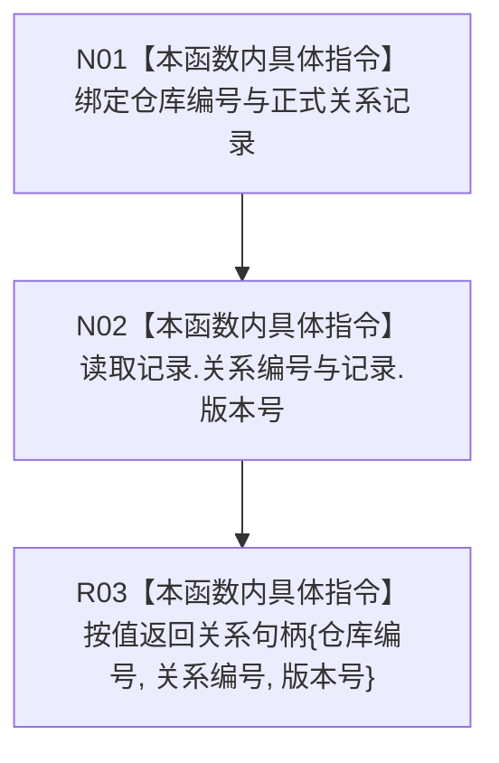

# CF-L6-0449 形成正式关系句柄现状流程图

图类型：现状流程图
代码版本：`4b80f1617dd70ec7a19e1a34efa9da768dce8927`
源码 blob：`89248cb1a21b2d49b000f92400990bb2c36ea6bc`
覆盖文件：`海中鱼巣/核心/仓库.正式关系.ixx:65-69`
唯一根函数：R1188
完整签名：`关系句柄 海中鱼巣::形成正式关系句柄(std::uint64_t 仓库编号, const 正式关系记录& 记录)`
参数：`仓库编号` 按值传入；`记录` 为调用期间有效的只读借用
返回结果：按值返回由仓库编号、记录关系编号和记录版本号组成的关系句柄
调用图：R1006、R1203、R1240、R1270 -> R1188；按正式图谱代码基线 `4b80f161`，RCE3586 的调用点为 1823，RCE3911—RCE3913 保持既有调用点；本函数无直接项目函数调用和外部边界
逐行映射表：`流程图/代码流程图/L6/CF-L6-0449_形成正式关系句柄_逐行代码映射表.md`
输入契约 / 调用语境表：四个调用方在已有正式关系记录或写后记录上形成仓内句柄
非成功返回二分审查表：无判断和非成功分支
偏差清单：无；执行器较新 HEAD 的行号漂移不写入 `4b80f161` 冻结关系表，留待本批发布后的增量维护
依据提交 / 结构化消息：`4b80f161`；正式身份 R1188、边 RCE3586、RCE3911—RCE3913
验证输出：本批仅源码、关系表、Mermaid 和逐行覆盖机械验证
不得作为施工许可：是
不得宣称：句柄形成代表关系记录已发布、有效或已经持久化

## 流程图

## 当前边界

- 本函数不检查仓库编号、记录完整性或记录状态，只投影三个句柄字段。
