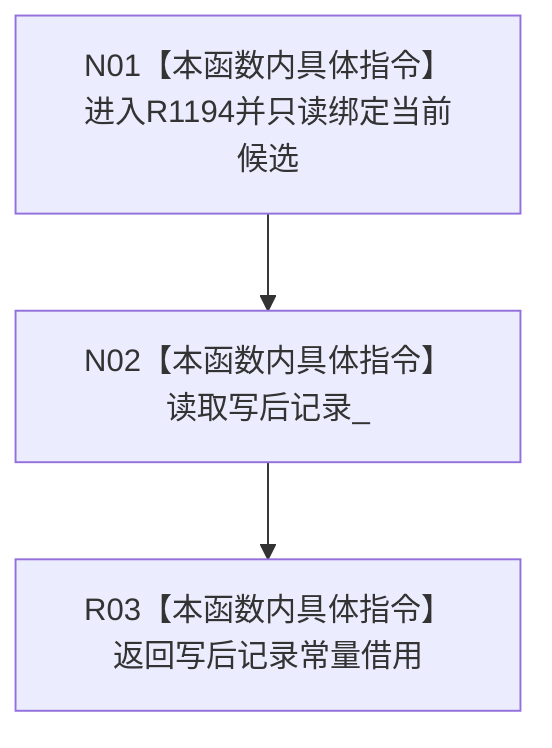

# CF-L6-0450 读取正式关系候选写后记录现状流程图

图类型：现状流程图
代码版本：`4b80f1617dd70ec7a19e1a34efa9da768dce8927`
源码 blob：`89248cb1a21b2d49b000f92400990bb2c36ea6bc`
覆盖文件：`海中鱼巣/核心/仓库.正式关系.ixx:142`
唯一根函数：R1194
完整签名：`const 正式关系记录& 海中鱼巣::正式关系候选::读取写后记录() const`
参数：无显式参数；只读访问当前正式关系候选
返回结果：返回候选内 `写后记录_` 的常量借用，生命周期不超过候选对象
调用图：R1266（RCE3919）、R1270（RCE3920）以及 `4b80f161` 冻结源码 R1147 在自检 943 经 RCE4550 调用 R1194；本函数无直接项目函数调用和外部边界
逐行映射表：`流程图/代码流程图/L6/CF-L6-0450_读取写后记录_逐行代码映射表.md`
输入契约 / 调用语境表：写入会话标记关系已读回和完成确认时读取候选写后记录；六仓批量恢复自检读取候选稳定主键
非成功返回二分审查表：无判断和非成功分支
偏差清单：R1147 在 `自检.节点直接身份结构写入.ixx:943` 的直接入边已登记为 RCE4550
依据提交 / 结构化消息：`4b80f161` 正式图谱代码基线；正式身份 R1194、稳定入边 RCE3919/RCE3920/RCE4550
验证输出：本批仅源码、关系表、Mermaid 和逐行覆盖机械验证
不得作为施工许可：是
不得宣称：取得写后记录引用代表记录已提交、发布或完成读回

## 流程图

## 当前边界

- 返回引用不转移所有权；调用方必须保证候选对象继续存活。
