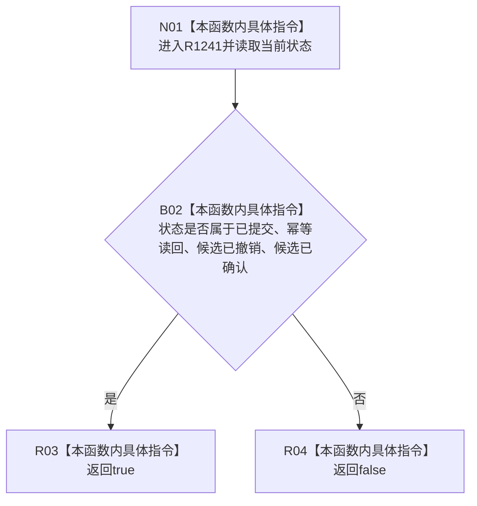

# CF-L6-0468 `节点直接身份结构写入结果::成功` 现状流程图

图类型：现状流程图
代码版本：`4b80f1617dd70ec7a19e1a34efa9da768dce8927`
源码 blob：`ca407389bb111031643ec2d9fa41157166775db6`
覆盖文件：`海中鱼巣/核心/会话.节点直接身份结构写入.ixx:41-46`
唯一根函数：R1241
完整签名：`bool 海中鱼巣::节点直接身份结构写入结果::成功() const`
参数：仅借用 const `this`，不保存引用
返回结果：状态为 `已提交`、`幂等读回`、`候选已撤销` 或 `候选已确认` 时返回 true，其余状态返回 false
已登记调用方：R0934（RCE3410）、R0950（RCE3474）、R1242（RCE4003）
直接项目函数：无
外部边界：无
逐行映射表：`流程图/代码流程图/L6/CF-L6-0468_成功_逐行代码映射表.md`
非成功口径：false 只表示当前状态不在四种成功集合中，不区分入口拒绝、资源失败、内部不一致或其它状态
不得作为施工许可：是
不得宣称：true 证明后续事务仍保持同一状态，或 false 唯一证明某一种失败原因

## 流程图

## 当前边界

- 四个枚举比较按 `||` 短路求值；函数只读状态，不修改结果对象。
- 本函数声明 `noexcept`，当前表达式不形成外部边界或项目调用。
