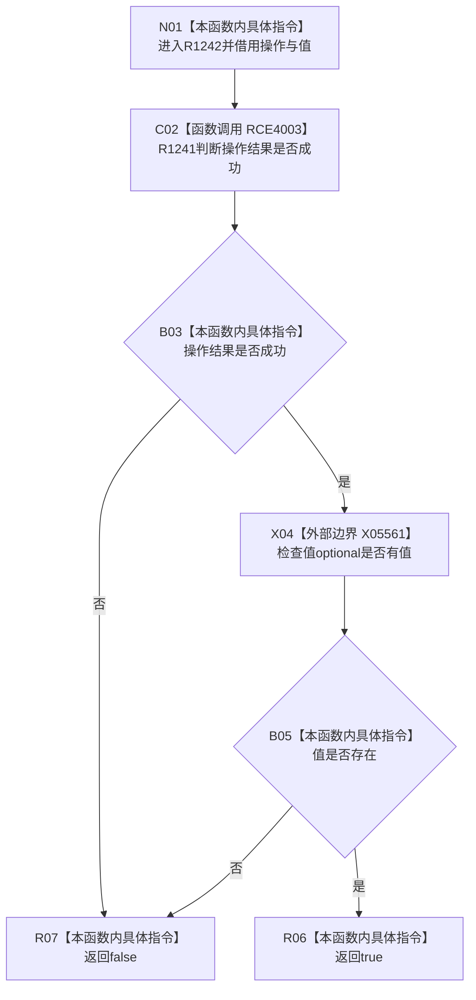

# CF-L6-0469 `节点直接身份带值结构写入结果<值类型>::成功` 现状流程图

图类型：现状流程图
代码版本：`4b80f1617dd70ec7a19e1a34efa9da768dce8927`
源码 blob：`ca407389bb111031643ec2d9fa41157166775db6`
覆盖文件：`海中鱼巣/核心/会话.节点直接身份结构写入.ixx:54-54`
唯一根函数：R1242
完整签名：`bool 海中鱼巣::节点直接身份带值结构写入结果<值类型>::成功() const`
参数：仅借用 const `this`，不保存引用
返回结果：R1241 判定操作成功且 X05561 判定值 optional 有值时返回 true，否则返回 false
源码事实调用方：R1136（RCE3734）、R1137（RCE3748）、R1265（RCE4006）；冻结表中的 RCE4004、RCE4005 均为错误入向投影，分别应改指 R1502、R1159
直接项目函数：R1241（RCE4003）
外部边界：X05561 `std::optional<T>::has_value()`
逐行映射表：`流程图/代码流程图/L6/CF-L6-0469_成功_逐行代码映射表.md`
非成功口径：操作状态不成功或值为空都会返回 false；短路时不会读取 optional 的有值状态
不得作为施工许可：是
不得宣称：false 唯一证明操作失败，或 true 证明值对应的候选已经最终发布

## 流程图

## 当前边界

- `&&` 保持短路：只有操作成功才调用 X05561。
- RCE4004、RCE4005 的静态接收者分别不是本模板结果类型；两条边从 R1242 入向投影移除后，不改变 R1242 自身实现或剩余可达路径。
