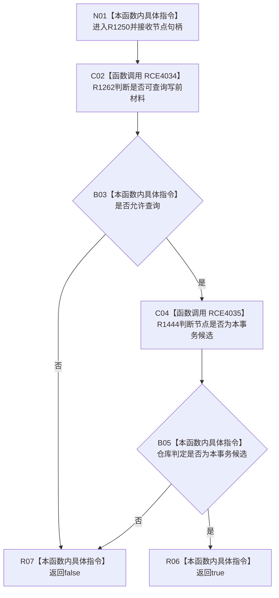

# CF-L6-0470 `节点直接身份结构写入会话::节点是本会话候选` 现状流程图

图类型：现状流程图
代码版本：`4b80f1617dd70ec7a19e1a34efa9da768dce8927`
源码 blob：`ca407389bb111031643ec2d9fa41157166775db6`
覆盖文件：`海中鱼巣/核心/会话.节点直接身份结构写入.ixx:225-227`
唯一根函数：R1250
完整签名：`bool 海中鱼巣::节点直接身份结构写入会话::节点是本会话候选(节点句柄 节点) const`
参数：节点句柄按值输入；只读借用当前会话
返回结果：R1262 允许查询且 R1444 判定节点是当前事务候选时返回 true，否则返回 false
已登记调用方：R1251（RCE4036）、R1252（RCE4037）、R1276（RCE4038）
直接项目函数：R1262（RCE4034）、R1444（RCE4035）
外部边界：无
逐行映射表：`流程图/代码流程图/L6/CF-L6-0470_节点是本会话候选_逐行代码映射表.md`
非成功口径：不可查询或仓库判定非本事务候选都会返回 false；短路时不调用 R1444
不得作为施工许可：是
不得宣称：false 证明节点不存在，或 true 证明候选已经确认或发布

## 流程图

## 当前边界

- `&&` 保持短路，入口不可查询时不触碰节点仓候选判定。
- 本函数只返回瞬时事务候选判定，不改变会话或仓库状态。
