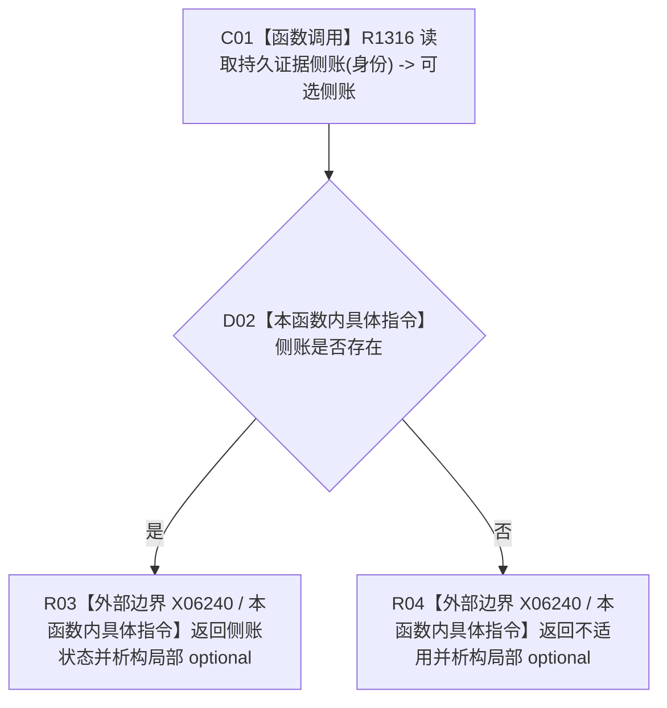

# CF-L6-0491 读取持久证据状态现状流程图

图类型：现状流程图
代码版本：`4b80f1617dd70ec7a19e1a34efa9da768dce8927`
源码 blob：`51f626fd79eb63dba5b57bf329ef3aae0a59abbc`
覆盖文件：`海中鱼巣/核心/仓库.节点直接事务幂等.ixx:104-107`
唯一根函数：R1317
完整签名：`持久证据状态 海中鱼巣::节点直接事务幂等仓库::读取持久证据状态(节点直接事务幂等身份 身份) const noexcept`
参数：身份按值；函数只读借用当前仓库
返回结果：侧账存在时返回其状态；否则返回 `持久证据状态::不适用`
调用图：R0978/R1147/R1149 -> R1317；R1317 -> R1316（读取持久证据侧账）
逐行映射表：`流程图/代码流程图/L6/CF-L6-0491_读取持久证据状态_逐行代码映射表.md`
输入契约 / 调用语境表：执行器和节点直接身份结构写入自检读取当前持久证据状态
非成功返回二分审查表：侧账空结果映射为不适用；R1316 的未命中与异常在此不可区分
偏差清单：RCE4295 调用点应精确到第 105 行
依据提交 / 结构化消息：`4b80f161`
验证输出：本批仅文档机械验证
不得作为施工许可：是
不得宣称：不适用必然表示未建立侧账，读取异常也会形成相同结果

## 流程图

## 当前边界

- 本函数只是侧账可选值到状态枚举的投影，不改变侧账。
