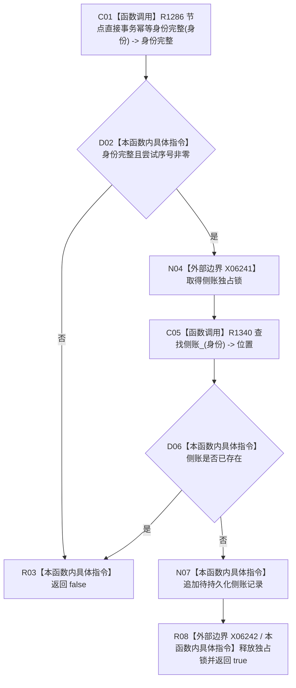

# CF-L6-0492 建立临时持久证据侧账现状流程图

图类型：现状流程图
代码版本：`4b80f1617dd70ec7a19e1a34efa9da768dce8927`
源码 blob：`51f626fd79eb63dba5b57bf329ef3aae0a59abbc`
覆盖文件：`海中鱼巣/核心/仓库.节点直接事务幂等.ixx:109-116`
唯一根函数：R1318
完整签名：`bool 海中鱼巣::节点直接事务幂等仓库::建立临时持久证据侧账(节点直接事务幂等身份 身份, std::uint64_t 尝试序号)`
参数：身份、尝试序号均按值；尝试序号必须非零
返回结果：输入有效且身份尚无侧账时插入待持久化记录并返回 true，否则返回 false；容器异常向调用方传播
调用图：R1006/R1147 -> R1318；R1318 -> R1286（身份完整）、R1340（查找侧账）
逐行映射表：`流程图/代码流程图/L6/CF-L6-0492_建立临时持久证据侧账_逐行代码映射表.md`
输入契约 / 调用语境表：执行器建立持久尝试；自检建立临时侧账
非成功返回二分审查表：身份不完整、尝试序号为零或侧账已存在均返回 false 且不改变结构
偏差清单：RCE4297/RCE4298 调用点应分别精确到第 111/113 行
依据提交 / 结构化消息：`4b80f161`
验证输出：本批仅文档机械验证
不得作为施工许可：是
不得宣称：临时侧账建立代表持久化已经完成

## 流程图

## 当前边界

- 本函数只建立内存侧账；未捕获的锁或容器异常会离开函数。
