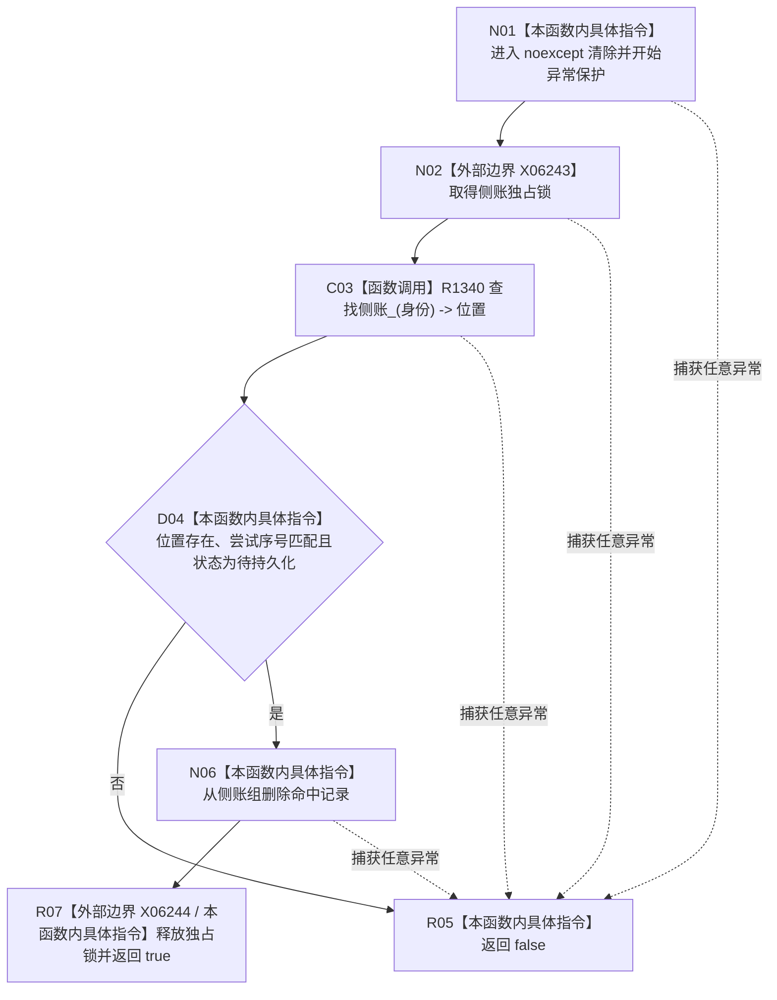

# CF-L6-0493 清除临时持久证据侧账现状流程图

图类型：现状流程图
代码版本：`4b80f1617dd70ec7a19e1a34efa9da768dce8927`
源码 blob：`51f626fd79eb63dba5b57bf329ef3aae0a59abbc`
覆盖文件：`海中鱼巣/核心/仓库.节点直接事务幂等.ixx:118-128`
唯一根函数：R1319
完整签名：`bool 海中鱼巣::节点直接事务幂等仓库::清除临时持久证据侧账(节点直接事务幂等身份 身份, std::uint64_t 尝试序号) noexcept`
参数：身份、尝试序号均按值
返回结果：仅当命中同尝试序号且状态为待持久化的侧账时删除并返回 true；不匹配或异常时返回 false
调用图：R1006/R1152 -> R1319；R1319 -> R1340（查找侧账）
逐行映射表：`流程图/代码流程图/L6/CF-L6-0493_清除临时持久证据侧账_逐行代码映射表.md`
输入契约 / 调用语境表：执行器失败补偿和专项自检清除临时侧账
非成功返回二分审查表：未命中、序号不符、状态不符为拒绝删除；异常为内部失败，均返回 false
偏差清单：RCE4299 调用点应精确到第 122 行
依据提交 / 结构化消息：`4b80f161`
验证输出：本批仅文档机械验证
不得作为施工许可：是
不得宣称：返回 false 能区分输入拒绝与内部异常

## 流程图

## 当前边界

- 本函数只允许删除仍为待持久化且尝试序号匹配的临时侧账。
