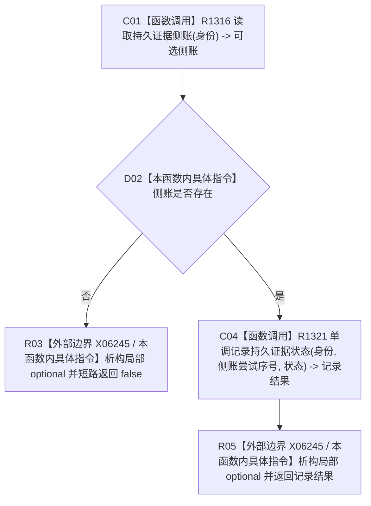

# CF-L6-0494 单调记录持久证据状态双参数重载现状流程图

图类型：现状流程图
代码版本：`4b80f1617dd70ec7a19e1a34efa9da768dce8927`
源码 blob：`51f626fd79eb63dba5b57bf329ef3aae0a59abbc`
覆盖文件：`海中鱼巣/核心/仓库.节点直接事务幂等.ixx:130-135`
唯一根函数：R1320
完整签名：`bool 海中鱼巣::节点直接事务幂等仓库::单调记录持久证据状态(节点直接事务幂等身份 身份, 持久证据状态 状态) noexcept`
参数：身份、目标状态均按值
返回结果：侧账存在时把侧账尝试序号转交 R1321 并返回其结果；侧账为空时返回 false
调用图：R1147 -> R1320；R1320 -> R1316（读取侧账）、R1321（三参数状态记录重载）
逐行映射表：`流程图/代码流程图/L6/CF-L6-0494_单调记录持久证据状态_逐行代码映射表.md`
输入契约 / 调用语境表：专项自检用当前侧账尝试序号推进持久证据状态
非成功返回二分审查表：侧账不存在或 R1321 拒绝/异常均返回 false；本重载不区分原因
偏差清单：RCE4296/RCE4300 调用点应分别精确到第 133/134 行
依据提交 / 结构化消息：`4b80f161`
验证输出：本批仅文档机械验证
不得作为施工许可：是
不得宣称：返回 true 代表持久化已被外部系统独立验证

## 流程图

## 当前边界

- 本函数不直接写侧账，只选择当前尝试序号并转调三参数重载。
