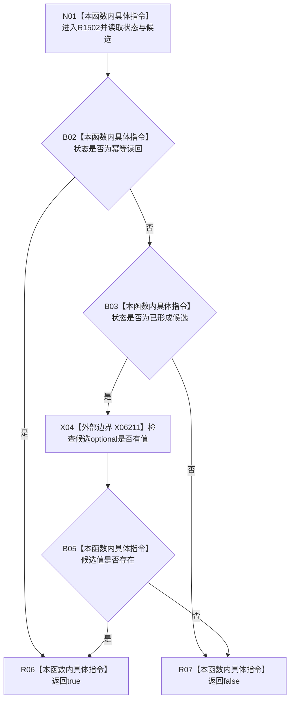

# CF-L6-0549 `节点直接身份创建结果::成功` 现状流程图

图类型：现状流程图
代码版本：`4b80f1617dd70ec7a19e1a34efa9da768dce8927`
源码 blob：`fe0bb869e17f1cbbc3621a5d48d85e7e9ac41598`
覆盖文件：`海中鱼巣/核心/仓库.节点直接身份.ixx:237-240`
唯一根函数：R1502
完整签名：`bool 海中鱼巣::节点直接身份创建结果::成功() const`
参数：仅借用 const `this`，不保存引用
返回结果：状态为 `幂等读回` 时返回 true；否则只有状态为 `已形成候选` 且 X06211 判定候选 optional 有值时返回 true，其余返回 false
已登记调用方：R1244（原地纠正后的 RCE4004，`海中鱼巣/核心/会话.节点直接身份结构写入.ixx:106`）
直接项目函数：无
外部边界：X06211 `std::optional<T>::has_value() const noexcept`（`海中鱼巣/核心/仓库.节点直接身份.ixx:239`）
逐行映射表：`流程图/代码流程图/L6/CF-L6-0549_成功_逐行代码映射表.md`
非成功口径：false 合并非幂等、非已形成候选，以及状态虽为已形成候选但候选值缺失三类情况
不得作为施工许可：是
不得宣称：true 证明候选已确认或发布，或 false 唯一证明某一种拒绝原因

## 流程图

## 当前边界

- `||` 与 `&&` 均保持短路：幂等读回不检查候选；非已形成候选也不调用 X06211。
- 本函数声明 `noexcept`，只读结果字段，不修改候选或仓库。
