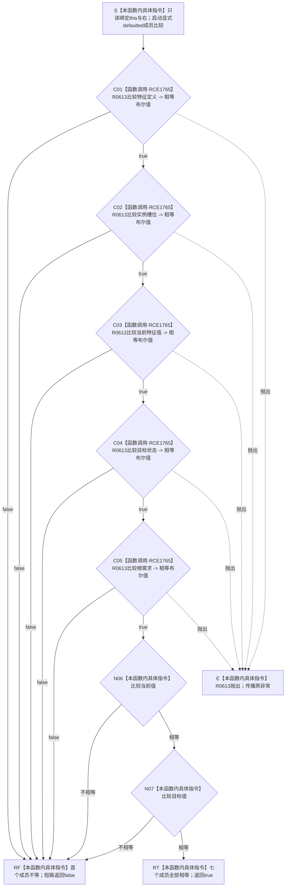

# CF-L7-0002 `系统根需求角色材料::operator==` 现状流程图

图类型：现状流程图
代码版本：`747223647b2cc5796db66a048009d78fa4d96ed7`
源码 blob：`c26b12e291f7192b887ef01efce9e6dc157e9cef`
覆盖文件：`海中鱼巣/领域/系统角色清单.数据.h:143-150,157`
唯一根函数：R0614
完整签名：`bool 海中鱼巣::系统根需求角色材料::operator==(const 海中鱼巣::系统根需求角色材料&) const`
参数：隐式 `this` 与未命名的 `const 系统根需求角色材料&`（下称 `右`）均为调用期间有效的只读借用
返回结果：依次比较五个身份材料成员、`当前值` 和 `目标值`；首个不等返回 `false`，全部相等返回 `true`
非法值 / 拒绝：无；不调用 `完整()`，不检查当前值或目标值的业务约束
已登记调用方：F0456 经 RCE1764 静态调用 2 次
直接项目函数：R0613 经 RCE1765 静态调用 5 次
外部边界：无；`std::int64_t` 的相等比较是内建指令
未解析项目调用：无
调用图：`流程图/主程序可达调用关系/01_main可达项目调用边表.md`
外部边界表：`流程图/主程序可达调用关系/02_main可达外部边界表.md`
逐行映射表：`流程图/代码流程图/L7/CF-L7-0002_系统根需求角色材料相等运算符_逐行代码映射表.md`
输入契约 / 调用语境表：本文“调用语境与结果分账”
非成功返回二分审查表：本文“调用语境与结果分账”
偏差清单：本文“当前边界与规范核对”
依据提交 / 结构化消息：冻结提交 `747223647b2cc5796db66a048009d78fa4d96ed7`；目标源码 blob 与该提交一致
结构读取与写入：只读两个根需求材料对象的七个直接成员；不写需求、特征、状态或其它机器事实
逻辑内返回：`false` 是值对象不等结果
内部错误：无结构化错误分支；R0613 若抛出则传播原异常
生命周期与资源释放：不加锁、不分配资源、不保留借用
异常：声明未写 `noexcept`，静态合同为 potentially-throwing
并发 / 幂等：纯只读值比较
验证入口：`系统角色清单.数据.h:143-150,157`、RCE1764—RCE1765
验证输出：9 个源码行位点映射到 11 个流程节点；1 个项目入边、1 个聚合项目出边、5 次静态项目调用、0 个外部边界、0 个未解析调用；本批不运行构建或程序
依据：`规范/0050_项目通用机器逻辑与禁止性规则总纲_20260721.md`、`规范/0600_代码函数流程图应用与维护规范.md`、`规范/4010_子规范_统一仓库稳定句柄与通用关系索引边界.md`、`规范/7130_子规范_自我内部世界成员特征与事实读取投影.md`
不得作为施工许可：是
不得宣称：两个根需求材料值相等就证明五个身份完整、当前值与目标值合法、根需求已经发布或任何需求闭环已经完成

## 流程图

## 节点合同

| 节点 | 类型 | 参数 / 输入绑定 | 结果 / 输出绑定 | 事实读写 | 后继条件 | 稳定边 |
| --- | --- | --- | --- | --- | --- | --- |
| S | 本函数内具体指令 | `this`、`右` | 两个只读借用 | 无 | 进入 C01 | 不适用 |
| C01—C05 | 函数调用 | 两侧同名身份成员分别绑定为 R0613 的 `this` 和右实参 | 对应身份材料相等布尔值 | 只读身份材料 | false 到 RF；true 到下一节点；异常到 E | RCE1765 |
| N06 | 本函数内具体指令 | 两侧 `当前值` | 内建整数相等布尔值 | 只读数值 | 不等到 RF；相等到 N07 | 不适用 |
| N07 | 本函数内具体指令 | 两侧 `目标值` | 内建整数相等布尔值 | 只读数值 | 不等到 RF；相等到 RT | 不适用 |
| RF / RT | 本函数内具体指令 | 首个不等或全部相等 | `false` / `true` | 无 | 函数返回 | 不适用 |
| E | 本函数内具体指令 | R0613 异常 | 原异常 | 不形成布尔结果 | 异常离开函数 | 不适用 |

## 已登记调用方

| 调用边 | 调用方 / 位置 | 静态次数 | 当前实参绑定 | 结果用途 |
| --- | --- | --- | --- | --- |
| RCE1764 | F0456 `系统角色主体材料::operator==(...) const` / `系统角色清单.数据.h:212` | 2 | 两侧主体的 `安全根需求`、`服务根需求` | 任一根需求材料不等使 F0456 短路返回 false |

## 调用语境与结果分账

| 语境 | 当前输入 | 当前结果 | 非成功口径 | 结构后果 |
| --- | --- | --- | --- | --- |
| F0456 defaulted 主体比较 | 两侧安全或服务根需求材料 | 首个成员不等返回 `false`；全部相等返回 `true` | 正常值比较结果 | 无结构变化 |
| R0613 调用抛出 | 已进入相应身份成员比较 | 原异常传播 | 不形成逻辑内布尔结果 | 无结构写入 |

## 当前边界与规范核对

- RCE1765 聚合五个按声明顺序执行的 R0613 静态调用；任一调用返回 false 即停止后续比较。
- `当前值` 与 `目标值` 只做相等比较，不检查 `当前值 >= 0` 或 `目标值 > 当前值`。
- 函数不调用 `完整()`，相等不能证明身份材料和数值组合满足根需求角色材料合同。
