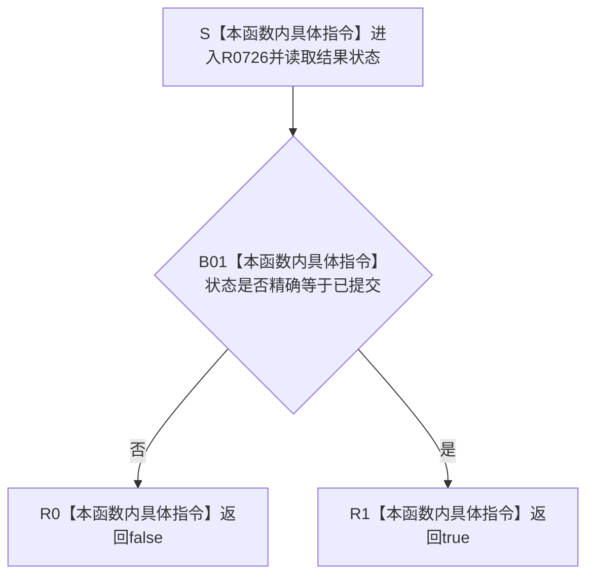

# CF-L7-0003 `概念活动初始化结果::改变了结构` 现状流程图

图类型：现状流程图
代码版本：`5cc7036de0decad163293a0b77c4789f068fd73a`
源码 blob：`a4090a7643aa12c41f2830eb5f51593aabde7488`
覆盖文件：`海中鱼巣/领域/概念活动状态.数据.h:216`
唯一根函数：R0726
完整签名：`bool 海中鱼巣::概念活动初始化结果::改变了结构() const noexcept`
参数：无显式参数；隐式 `this` 是调用期有效的 const 结果借用
返回结果：状态精确等于 `已提交` 时 true，否则 false
已登记调用方：F0462 经 RCE2193
直接项目函数：无
外部边界：无；未解析项目调用：无
逐行映射表：`流程图/代码流程图/L7/CF-L7-0003_概念活动初始化结果改变了结构_逐行代码映射表.md`
不得作为施工许可：是

当前函数只投影本次结果状态，不证明提交内容完整、后续状态不漂移或整体能力完成。
