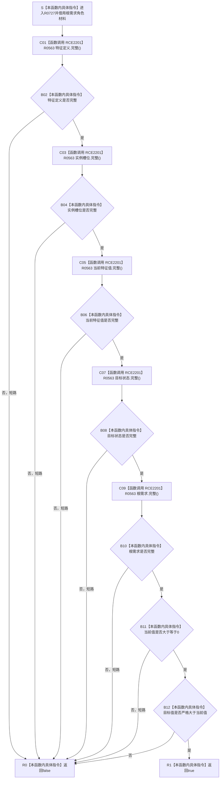

# CF-L7-0004 `系统根需求角色材料::完整` 现状流程图

图类型：现状流程图
代码版本：`5cc7036de0decad163293a0b77c4789f068fd73a`
源码 blob：`c26b12e291f7192b887ef01efce9e6dc157e9cef`
覆盖文件：`海中鱼巣/领域/系统角色清单.数据.h:152-155`
唯一根函数：R0727
完整签名：`bool 海中鱼巣::系统根需求角色材料::完整() const noexcept`
参数：无显式参数；隐式 `this` 是调用期有效的 const 材料借用
返回结果：五个身份材料完整、当前值非负且目标值严格大于当前值时 true
已登记调用方：F0458 经 RCE2175
直接项目函数：R0563/RCE2201
外部边界：无；未解析项目调用：无
逐行映射表：`流程图/代码流程图/L7/CF-L7-0004_系统根需求角色材料完整_逐行代码映射表.md`
不得作为施工许可：是

RCE2201 合并五个同一 caller/callee 的静态调用表达式；内建整数比较不登记项目边。
