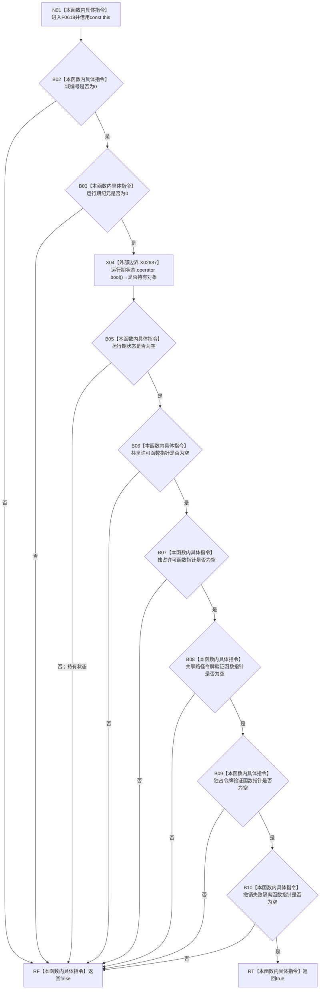

# CF-L7-0005 结构事务接线完全未接域现状流程图

图类型：现状流程图
代码版本：`711f200665a0e25e2a5801f144c6ad70b42cc787`
源码 blob：`9d89cee25f00ba0f721d0b6c1bea517524e40663`
覆盖文件：`海中鱼巣/核心/结构事务接线.数据.h:72-75`
唯一根函数：F0618
完整签名：`bool 海中鱼巣::结构事务接线::完全未接域() const`
参数：无显式参数；隐式 const `this` 为调用期间有效的非拥有借用
返回结果：域编号、运行期纪元均为零，运行期状态为空，五个函数指针均为空时返回 `true`，否则返回 `false`
已登记调用方：F0321 经 E1638
直接项目函数：无
外部边界：X02687 `std::shared_ptr<void>::operator bool() const noexcept`
未解析项目调用：0
调用图：`流程图/主程序可达调用关系/01_main可达项目调用边表.md`
逐行映射表：`流程图/代码流程图/L7/CF-L7-0005_结构事务接线完全未接域_逐行代码映射表.md`
偏差清单：无；本文只冻结当前接线形态判断
依据提交 / 结构化消息：当前源码、F0618、E1638、X02687 交叉复核
结构读取与写入：只读接线字段，零机器事实写入
逻辑内返回：任一字段非空或非零时返回 `false`
内部错误：无
生命周期与资源释放：只借用 shared_ptr，不改变引用计数所有权
异常：函数体只含无抛出值 / 指针检查及 X02687
并发 / 幂等：不加锁；调用方须保证接线对象在判断期间不被并发改写
验证输出：72—75 行完整映射；1 条项目入边、0 条项目出边、1 个外部边界、0 个未解析调用
不得作为施工许可：是
不得宣称：返回 `false` 唯一证明接线完整，或返回 `true` 证明运行期不存在其它事务对象

## 流程图

## 当前边界

- X02687 只检查 `运行期状态` 是否持有对象，不复制 shared_ptr，也不访问所指对象。
- 五个函数指针使用内建指针布尔转换，不是项目函数调用或外部函数边界。
- 本函数区分“全部为空”与“至少一项非空”，不能单独证明非空形态就是完整接域；完整形态由 F0321 组合判断。
