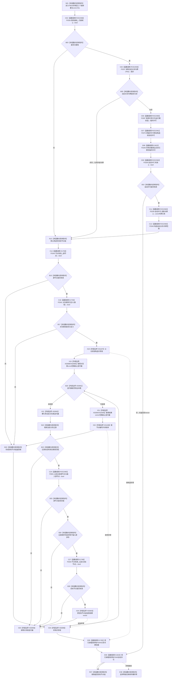

# CF-L7-0006 关系仓库获取目标节点组按顺序号现状流程图

图类型：现状流程图
代码版本：`711f200665a0e25e2a5801f144c6ad70b42cc787`
源码 blob：`f7a9ea9a09d3065468208c16f9ea34f806b6e183`
覆盖文件：`海中鱼巣/核心/关系仓库.cpp:823-841`；宏展开依据同文件 `116-123`
唯一根函数：F0620
完整签名：`std::vector<海中鱼巣::节点句柄> 海中鱼巣::关系仓库::获取目标节点组(海中鱼巣::节点句柄 源节点, 海中鱼巣::关系类型 类型, std::int64_t 顺序号) const`
参数：源节点、关系类型、顺序号按值传入；隐式 const `this` 为调用期间有效的非拥有借用
返回结果：在共享许可与仓库共享锁窗口内，返回状态、类型、源节点、顺序号匹配且目标节点当前有效的目标句柄，按节点编号升序排列
已登记调用方：F0330 经 E1669；R0077 经 RCE0476；R0220 经 RCE0776；R0483 经 RCE1478
直接项目函数：宏 RCE2358→F0336、RCE2359→F0337、RCE2360→F0397、RCE2361→F0375、RCE2362→F0338、RCE2363→F0339、RCE2364→F0340；E1754→F0341；E1769→F0343；RCE2365→F0051；E1792→F0344；E1822→F0345
外部边界：X01197 共享锁构造；X02688—X02692 关系表 const 迭代；X02693 结果追加；X02694—X02695 结果范围；X01198 排序；X02696 共享锁析构
未解析项目调用：0；RCE2360 按当前生产接线唯一绑定 F0397
调用图：`流程图/主程序可达调用关系/01_main可达项目调用边表.md`
逐行映射表：`流程图/代码流程图/L7/CF-L7-0006_关系仓库获取目标节点组按顺序号_逐行代码映射表.md`
偏差清单：无；本文按正式分配的宏七边和容器边界冻结当前代码事实
依据提交 / 结构化消息：当前源码、全部入边、E1754、E1769、E1792、E1822、RCE2358—RCE2365、X01197—X01198、X02688—X02696 交叉复核
结构读取与写入：只读事务接线、关系表和节点有效性；只改变局部结果 vector
逻辑内返回：许可无效、入口无效或无匹配候选时返回空 vector
内部错误：异常不包装为空结果
生命周期与资源释放：共享锁经 X02696 先释放；已承载令牌范围经 E1792 析构后，再经 E1822 析构许可
异常：未捕获；许可、锁、容器和被调查询异常在逆序释放已构造资源后传播
并发 / 幂等：共享锁覆盖关系表读取、排序和返回材料形成；返回后不再持有锁或事务见证
验证输出：823—841 行完整映射；4 条项目入边、12 个项目出边 ID、11 个外部边界 ID、0 个未解析调用
不得作为施工许可：是
不得宣称：空 vector 唯一证明关系不存在、返回组是返回后的持续快照或本函数修改了关系

## 流程图

## 项目源码调用合同

| 调用边 | 被调函数 | 实参 / 条件 | 结果用途 |
| --- | --- | --- | --- |
| RCE2358 | F0336 `已接域()` | `this=&事务接线_` | 决定是否检查当前关系令牌 |
| RCE2359 | F0337 `读取当前关系令牌` | `*this`；仅已接域 | 非空时复用外层语境 |
| RCE2360 | F0397 共享许可函数对象 | 运行期状态；仅无现有令牌 | 临时许可 |
| RCE2361 | F0375 许可移动构造 | RCE2360 临时许可 | 承载到自动许可 optional |
| RCE2362 | F0338 `有效()` | 自动许可 | 无效时宏返回空 vector |
| RCE2363 | F0339 `读取令牌()` | 有效自动许可 | const 令牌引用 |
| RCE2364 | F0340 关系令牌范围构造 | `*this`、令牌引用 | 建立当前关系令牌语境 |
| E1754 | F0341 `关系类型已定义` | 输入类型 | 入口过滤 |
| E1769 | F0343 `节点有效_` | 输入源节点；匹配记录目标节点 | 入口与候选过滤 |
| RCE2365 | F0051 节点句柄相等 | 记录源节点、输入源节点 | 源匹配 |
| E1792 / E1822 | F0344 / F0345 析构 | 已承载令牌范围 / 许可 | 正常或异常逆序释放 |

## 当前边界

- 宏展开的七条项目边顺序固定；完全未接域或已有同仓关系令牌时不会取得新许可。
- X01197 的共享锁从第 829 行持续到返回值形成，X02696 先于 E1792、E1822 释放。
- 返回 vector 只含目标节点句柄值，不携带关系句柄、顺序见证、锁、许可或事务令牌。
