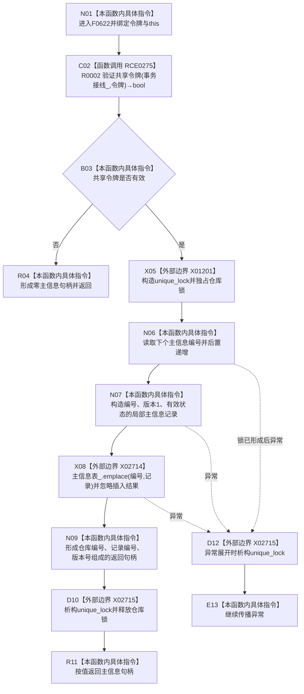

# CF-L7-0007 主信息仓库创建主信息现状流程图

图类型：现状流程图
代码版本：`3920a74638264f9f539d50f32f3c9fe5fb1982ab`
源码 blob：`11f8fa53ff961a8cbaac34cf75b69a22533ca907`
覆盖文件：`海中鱼巣/核心/主信息仓库.cpp:53-60`
唯一根函数：F0622
完整签名：`海中鱼巣::主信息句柄 海中鱼巣::主信息仓库::创建主信息(const 海中鱼巣::结构事务令牌& 令牌)`
参数：`令牌` 为调用期间有效的 const 引用；隐式 `this` 为非拥有借用
返回结果：令牌无效时返回零句柄；令牌有效时独占仓库锁、递增编号、插入有效主信息记录并返回旧三元句柄
已登记调用方：F0331 经 E1675；R0206 经 RCE0745；R0560 经 RCE1566；R0573 经 RCE1579；R0578 经 RCE1595
直接项目函数：RCE0275→R0002
外部边界：X01201 构造 `unique_lock`；X02714 调用 `unordered_map::emplace`；X02715 析构 `unique_lock`
未解析项目调用：0
调用图：`流程图/主程序可达调用关系/01_main可达项目调用边表.md`
逐行映射表：`流程图/代码流程图/L7/CF-L7-0007_主信息仓库创建主信息_逐行代码映射表.md`
偏差清单：`emplace` 的插入结果未检查；重复键时仍返回看似有效的句柄
结构读取与写入：通过令牌门禁后立即递增 `下个主信息编号_`，再向 `主信息表_` 插入记录
逻辑内返回：R0002 返回 false 时返回零句柄
内部错误：令牌已被上层许可验证但 R0002 仍拒绝，或 `emplace` 未插入却继续返回句柄
生命周期与资源释放：X01201 成功后，正常返回、早退或异常展开均经 X02715 释放独占锁
异常：锁构造或 X02714 插入异常向上传播；编号递增发生在插入前，插入异常会消耗编号
并发 / 幂等：持有独占锁完成编号分配和插入；每次成功调用生成新编号，不幂等
验证输出：53—60 行完整映射；5 条项目入边、1 条项目出边、3 个外部边界、0 个未解析调用
不得作为施工许可：是
不得宣称：插入结果已验证、失败会回滚编号或该旧仓库写入已经迁移为节点直接身份

## 流程图

## 调用与边界合同

| 稳定 ID | 目标 | 实参 / 条件 | 结果 |
| --- | --- | --- | --- |
| RCE0275 | R0002 `验证共享令牌` | `事务接线_`、`令牌`；函数入口 | bool 门禁 |
| X01201 | `std::unique_lock<std::shared_mutex>` 构造 | `仓库锁_`；令牌有效 | 局部独占锁 |
| X02714 | `主信息表_::emplace` | `编号`、`记录`；锁已持有 | 插入结果被忽略 |
| X02715 | `unique_lock` 析构 | `锁`；正常或异常离开作用域 | 释放仓库锁 |

## 当前边界

- RCE0275 失败发生在任何编号递增和仓库写入之前。
- X02714 发生前编号已经递增；异常不会回滚编号。
- 返回句柄在 X02715 释放锁后交给调用方，不拥有仓库记录。
