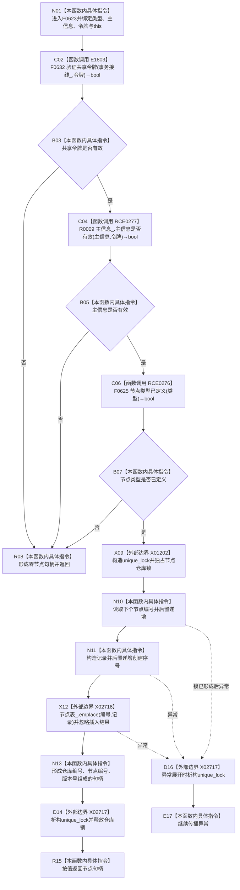

# CF-L7-0008 节点仓库创建节点现状流程图

图类型：现状流程图
代码版本：`3920a74638264f9f539d50f32f3c9fe5fb1982ab`
源码 blob：`f38b979a3f7cefd182a50e0b687c5a6fffebc91c`
覆盖文件：`海中鱼巣/核心/节点仓库.cpp:74-81`
唯一根函数：F0623
完整签名：`海中鱼巣::节点句柄 海中鱼巣::节点仓库::创建节点(海中鱼巣::节点类型 类型, 海中鱼巣::主信息句柄 主信息, const 海中鱼巣::结构事务令牌& 令牌)`
参数：类型与主信息句柄按值传入；令牌为 const 引用；隐式 `this` 为非拥有借用
返回结果：共享令牌、主信息和节点类型三项均通过时插入有效节点记录并返回旧三元句柄，否则返回零句柄
已登记调用方：F0332 经 E1680；R0206 经 RCE0746；R0560 经 RCE1567；R0573 经 RCE1581；R0578 经 RCE1596
直接项目函数：E1803→F0632、RCE0277→R0009、RCE0276→F0625
外部边界：X01202 构造 `unique_lock`；X02716 调用 `unordered_map::emplace`；X02717 析构 `unique_lock`
未解析项目调用：0
调用图：`流程图/主程序可达调用关系/01_main可达项目调用边表.md`
逐行映射表：`流程图/代码流程图/L7/CF-L7-0008_节点仓库创建节点_逐行代码映射表.md`
偏差清单：F0625 当前类型上界止于 `用途观察记录`；`emplace` 插入结果未检查
结构读取与写入：先读取事务、主信息和类型准入，再独占节点仓库、递增节点编号与创建序号并插入记录
逻辑内返回：任一准入条件为 false 时返回零句柄
内部错误：调用方已建立同代次前置但准入仍失败，或插入未成功却返回句柄
生命周期与资源释放：X01202 成功后经 X02717 在正常或异常退出时释放锁
异常：锁构造或 X02716 插入异常向上传播；异常不会回滚已递增编号或创建序号
并发 / 幂等：独占锁内分配两个序号并插入；每次成功调用创建新节点，不幂等
验证输出：74—81 行完整映射；5 条项目入边、3 条项目出边、3 个外部边界、0 个未解析调用
不得作为施工许可：是
不得宣称：返回句柄证明插入结果已核验、类型范围符合现行正式 ABI 或旧节点结构已迁移完成

## 流程图

## 调用与边界合同

| 稳定 ID | 目标 | 实参 / 条件 | 结果 |
| --- | --- | --- | --- |
| E1803 | F0632 `验证共享令牌` | `事务接线_`、`令牌`；函数入口 | bool 门禁 |
| RCE0277 | R0009 令牌重载 | `this=&主信息_`、`主信息`、`令牌`；E1803=true | 主信息有效 bool |
| RCE0276 | F0625 `节点类型已定义` | `类型`；前两项成立 | 类型已定义 bool |
| X01202 | `unique_lock` 构造 | `仓库锁_`；三项准入成立 | 局部独占锁 |
| X02716 | `节点表_::emplace` | `编号`、`记录`；锁已持有 | 插入结果被忽略 |
| X02717 | `unique_lock` 析构 | `锁`；正常或异常离开作用域 | 释放仓库锁 |

## 当前边界

- 第 75 行使用 `||` 短路，只有前项成立才调用后项。
- 编号和创建序号均在 X02716 前递增；插入异常不会回滚。
- 返回句柄不拥有节点记录或主信息记录。
