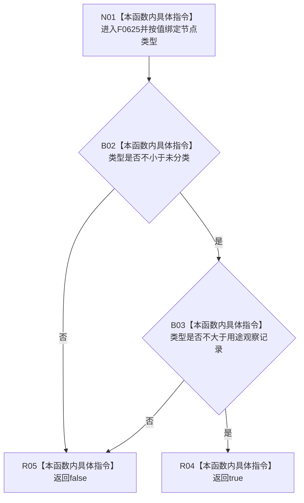

# CF-L7-0009 节点类型已定义现状流程图

图类型：现状流程图
代码版本：`3920a74638264f9f539d50f32f3c9fe5fb1982ab`
源码 blob：`f38b979a3f7cefd182a50e0b687c5a6fffebc91c`
覆盖文件：`海中鱼巣/核心/节点仓库.cpp:12-14`
唯一根函数：F0625
完整签名：`bool 海中鱼巣::{匿名命名空间@节点仓库.cpp}::节点类型已定义(海中鱼巣::节点类型 类型)`
参数：节点类型按值传入
返回结果：类型数值同时不小于 `未分类` 且不大于 `用途观察记录` 时返回 true，否则返回 false
已登记调用方：F0332 经 E1683；F0623 经 RCE0276
直接项目函数：无
外部边界：无
未解析项目调用：0
调用图：`流程图/主程序可达调用关系/01_main可达项目调用边表.md`
逐行映射表：`流程图/代码流程图/L7/CF-L7-0009_节点类型已定义_逐行代码映射表.md`
偏差清单：当前范围接受 `未分类(0)`，同时拒绝正式枚举中位于 `用途观察记录` 之后的 `文章`、`段落`、`自然句`、`子句`
结构读取与写入：无
逻辑内返回：类型落在当前硬编码闭区间外时返回 false
内部错误：调用方传入现行正式 ABI 已定义但超过旧上界的类型时发生错误拒绝
生命周期与资源释放：仅按值枚举参数，无资源持有
异常：无显式异常路径
并发 / 幂等：纯值比较，无共享状态；幂等
验证输出：12—14 行完整映射；2 条项目入边、0 条项目出边、0 个外部边界、0 个未解析调用
不得作为施工许可：是
不得宣称：该硬编码区间等价于现行正式节点类型全集或 `未分类` 可作为正常业务节点发布

## 流程图

## 当前边界

- F0625 是匿名命名空间内部链接函数，只在 `节点仓库.cpp` 内被直接调用。
- 第 13 行按 `&&` 短路；下界不成立时不需要计算上界比较。
- 返回值只反映当前源码闭区间，不提供类型语义、业务准入或发布许可。
